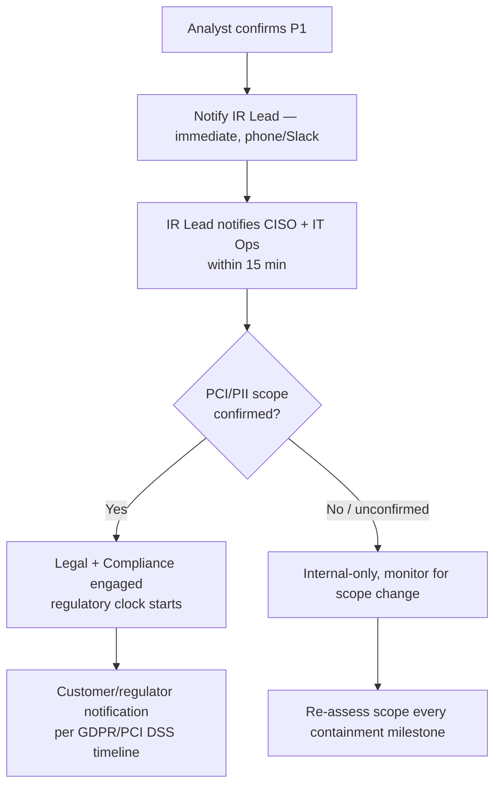
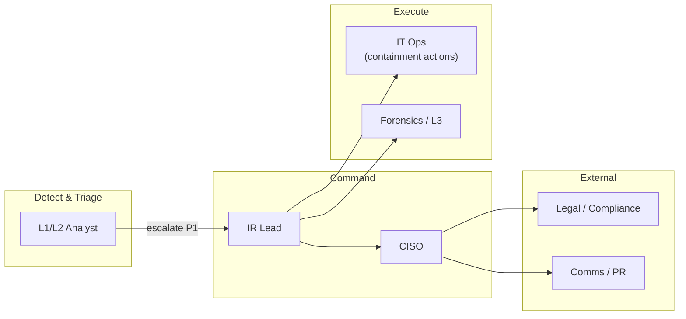
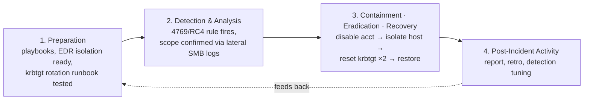
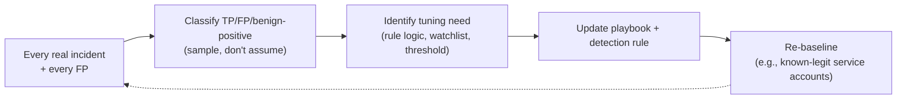

# Playbook 01 — Credential Theft → Lateral Movement → Ransomware Staging

> [!NOTE]
> Built end-to-end around one coherent, defensible scenario — detection through decision, containment, and lessons-learned — rather than generic guidance. Same architecture used in the [SOC-Incident-Orchestrator](https://github.com/CdxDebian/SOC-Incident-Orchestrator) project's policy-as-code guardrails, applied here on paper first.

**Contents:** Scenario Overview · Purpose and Scope · Risk Assessment · Policies and Procedures · Roles and Responsibilities · Incident Response Plan · Training · Continuous Improvement · Appendices

---

## 0. Scenario Overview

**Organization profile:** mid-size e-commerce company, ~800 endpoints, hybrid AD/Entra environment, PCI-adjacent payment data.

**Trigger:** a SIEM analytics rule fires — a single service account requests Kerberos TGS tickets (Event 4769) for 14 distinct SPNs in an 8-minute window, using RC4 encryption (`0x17`). Normal baseline for that account: 0–1 TGS requests/day.

**Full attack narrative:** a phished helpdesk credential → successful password spray against a low-privilege AD account → Kerberoasting to harvest a service-account hash → offline crack → lateral movement via that service account → discovery/staging for ransomware deployment, caught **before** encryption began.

### Attack chain mapped to MITRE ATT&CK

```mermaid
flowchart LR
    A["Phishing email<br/>T1566.001"] -->|credential harvested| B["Valid Accounts<br/>T1078<br/>(low-priv AD user)"]
    B --> C["Password Spray<br/>T1110.003<br/>(helpdesk account)"]
    C --> D["Kerberoasting<br/>T1558.003<br/>(4769 spike, RC4)"]
    D --> E["Offline hash crack<br/>(outside network — no telemetry)"]
    E --> F["Valid Accounts<br/>T1078<br/>(cracked service acct)"]
    F --> G["Discovery<br/>T1087 / T1018<br/>(AD + host enum)"]
    G --> H["Lateral Movement<br/>T1021.002<br/>(SMB admin shares)"]
    H --> I["Staging for Impact<br/>T1486<br/>(ransomware pre-deploy)"]

    style D fill:#7d2d2d,color:#fff
    style I fill:#7d2d2d,color:#fff
    style A fill:#4a4a4a,color:#fff
```



> [!TIP]
> The detection point is the Kerberoasting step itself — Event 4769, RC4 ticket encryption, 14 SPN requests in 8 minutes from an account that normally requests zero. That single anomaly is the pivot into the whole chain: work backward to the password-spray/phishing origin, and forward to catch lateral movement before impact. One high-fidelity signal beats ten low-fidelity ones.

---

## 1. Purpose and Scope

**Purpose:** standardize detection-to-recovery for credential-theft-driven lateral movement that precedes ransomware, so response time — not improvisation — determines the outcome.

**In scope:** on-prem AD, hybrid Entra ID, all Tier-1 (payment processing, customer PII) and Tier-2 assets, service accounts with registered SPNs.

**Out of scope:** pure cloud-native SaaS breaches (separate CASB/MDCA playbook), physical security incidents, HR-policy violations without a technical IOC.

---

## 2. Risk Assessment

| Category | Finding |
|---|---|
| Critical assets | Domain Controllers, payment-processing servers, customer database, backup infrastructure |
| Threat actors | Financially motivated ransomware affiliates (initial-access-broker supply chain), opportunistic credential-stuffing bots |
| Key vulnerabilities | Service accounts with weak/never-rotated passwords and RC4 still enabled; no MFA on helpdesk-tier accounts; flat network with limited east-west segmentation |
| Impact if unmitigated | Full domain compromise (Golden Ticket path), PCI scope breach, ransomware-driven downtime, regulatory notification (GDPR/PCI DSS) |

**Risk score (Confidence × Impact × Scope): HIGH** — RC4 Kerberoasting at this volume has almost no benign explanation (confidence), the lateral path reaches payment infrastructure (impact), and scope was actively expanding at detection time.

---

## 3. Policies and Procedures

*Structured as Detect → Classify → Respond → Communicate → Review.*

### 3.1 Detection

```kql
// Kerberoasting detection — the analytic rule that fires this scenario
SecurityEvent
| where EventID == 4769
| where TicketEncryptionType == "0x17"                 // RC4
| where TargetUserName !endswith "$"                    // exclude machine accounts
| summarize RequestCount = count(),
            Services = make_set(ServiceName)
            by Account = SubjectUserName, bin(TimeGenerated, 10m)
| where RequestCount >= 10
| project TimeGenerated, Account, RequestCount, Services
```

### 3.2 Classification

| Field | This incident |
|---|---|
| Category | Credential Access → Lateral Movement (pre-ransomware) |
| Severity | **P1 — Critical** (see [Appendix B](#appendix-b--severity--sla-matrix)) |
| Confidence | High — corroborated by 4769 pattern plus subsequent SMB admin-share access from the same source host |

### 3.3 Response (Contain → Eradicate → Recover)
1. **Contain:** disable the compromised service account; isolate the source host via EDR; block the destination hosts targeted by lateral SMB traffic.
2. **Eradicate:** reset the service account password (and any account it authenticated to); force a `krbtgt` password reset **twice**, 10+ hours apart, if Golden Ticket risk is suspected; remove any dropped persistence.
3. **Recover:** re-enable accounts only after validated clean; restore from backup only if integrity is confirmed untouched; monitor affected hosts at heightened sensitivity for 14 days.

### 3.4 Communication



### 3.5 Post-Incident Review
Structured 5-day-out retro — see [Section 7](#7-continuous-improvement).

> [!TIP]
> This detect-classify-respond-communicate flow maps directly onto the policy-as-code pattern (`ALLOW` / `REQUIRE_APPROVAL` / `BLOCK`) implemented in the [SOC-Incident-Orchestrator](https://github.com/CdxDebian/SOC-Incident-Orchestrator) project — the response step isn't just documented, it's enforced. A P1 like this routes to `REQUIRE_APPROVAL`, never auto-remediates: account disablement and host isolation are exactly the kind of high-impact actions that need a human in the loop.

---

## 4. Roles and Responsibilities



| Role | RACI |
|---|---|
| L1/L2 Analyst | **R** — detect, triage, initial containment recommendation |
| IR Lead | **A** — owns the incident, coordinates all actions |
| IT Ops | **R** — executes containment (disable, isolate, block) |
| Forensics/L3 | **C** — scoping, root-cause, evidence handling |
| CISO | **I → A** for regulatory-scope decisions |
| Legal/Compliance | **C** — notification-obligation determination |

> [!TIP]
> L2 analysts sit as Responsible, not Accountable — driving detection and containment recommendations fast, while the decision to notify regulators or engage legal sits with IR Lead/CISO by design. A clean escalation depends on knowing exactly where that boundary is.

---

## 5. Incident Response Plan

*Mapped to the NIST SP 800-61 four-phase lifecycle.*



**Key trade-off:** isolating the source host immediately vs. covert monitoring to capture the attacker's full toolset. Given confirmed lateral movement toward payment infrastructure, isolate immediately — the cost of losing visibility is outweighed by the cost of reaching PCI-scope systems.

---

## 6. Train and Educate

- **Tabletop exercise (quarterly):** this exact scenario, run live with L1s — inject the 4769 alert, time-box triage to 10 minutes, debrief against the decision tree in [Section 3.4](#34-communication).
- **Micro-drill (monthly, single analyst):** "here's a raw 4769 log excerpt — is this Kerberoasting or a legitimate batch job? Justify in three sentences."
- **Awareness:** phishing-simulation results feed directly back into the Section 2 risk assessment — the helpdesk-account weak point in this scenario is exactly what a phishing-sim would surface.

---

## 7. Continuous Improvement



**Concrete example:** post-incident, add a watchlist exception for any service account performing an *authorized* bulk-SPN operation (e.g., a legitimate migration script), so the next Kerberoasting alert isn't drowned out by a self-inflicted false positive — targeted suppression, not a blanket threshold change.

---

## Appendix A — MITRE ATT&CK Mapping

| Tactic | Technique | ID | Evidence in this scenario |
|---|---|---|---|
| Initial Access | Phishing: Spearphishing Attachment | T1566.001 | Helpdesk credential harvested |
| Credential Access | Brute Force: Password Spraying | T1110.003 | Low-priv AD account compromised |
| Credential Access | Steal or Forge Kerberos Tickets: Kerberoasting | T1558.003 | 4769/RC4 spike — the trigger alert |
| Persistence / Priv Esc | Valid Accounts | T1078 | Cracked service-account credential reused |
| Discovery | Account Discovery / Remote System Discovery | T1087 / T1018 | AD + host enumeration post-compromise |
| Lateral Movement | SMB/Windows Admin Shares | T1021.002 | Movement to payment-adjacent hosts |
| Impact | Data Encrypted for Impact | T1486 | Staging observed, encryption not yet triggered |

## Appendix B — Severity / SLA Matrix

| Severity | Definition | Ack/Triage SLA | This incident |
|---|---|---|---|
| P1 — Critical | Active lateral movement toward crown-jewel/PCI assets, ransomware precursor confirmed | Immediate (minutes) | ✅ Classified here |
| P2 — High | Confirmed credential theft, no confirmed lateral movement yet | < 30–60 min | — |
| P3 — Medium | Suspicious Kerberoasting pattern, unconfirmed | Same shift | — |
| P4 — Low | Informational / benign-positive (legit bulk SPN job) | Next business day | — |

## Appendix C — Design Notes / FAQ

<details>
<summary>Why start from a single Kerberoasting alert rather than the phishing email?</summary>

The phishing email and password spray produce low-fidelity, high-volume noise — most environments see thousands of phishing attempts. The 4769/RC4 pattern is the first point with near-zero benign explanation at that volume, making it the most efficient pivot: high confidence, and it supports working both backward (root cause) and forward (blast radius) from one anchor.
</details>

<details>
<summary>How could parts of this playbook be automated, and where should automation stop?</summary>

Event correlation and IOC enrichment can be fully automated. Risk scoring should be automated but *explainable* — persisting the contributing factors, not just a number. A policy-as-code gate (`ALLOW`/`REQUIRE_APPROVAL`/`BLOCK`) should sit in front of any containment action. Detection and enrichment scale with automation; account disablement and host isolation stay human-approved, because the blast radius of a wrong automated action here is business-critical.
</details>

<details>
<summary>What's the weakest part of this playbook?</summary>

The regulatory-notification branch assumes PCI/PII scope gets confirmed fast. In practice, scope confirmation is often the slowest part of a real incident, and modeling it as a quick yes/no gate understates that. A dedicated data-classification/scoping sub-playbook would be a better fit than one decision-tree node.
</details>

---

**Related:** [Playbook 02 — WAF/DDoS Data Integrity](./02-waf-ddos-data-integrity.md) · [Repository overview](../README.md)
