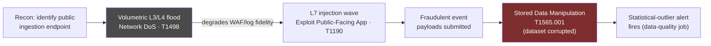
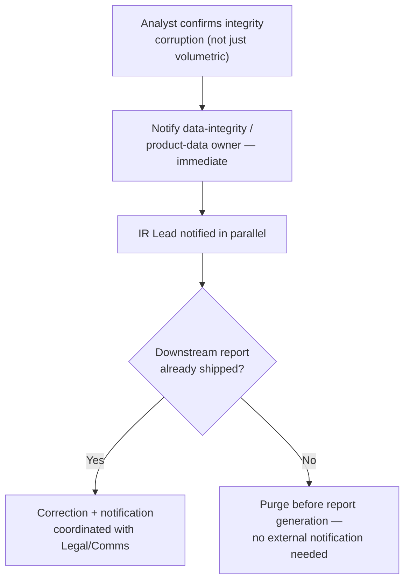
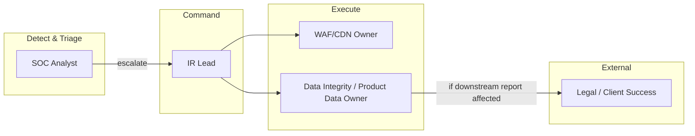
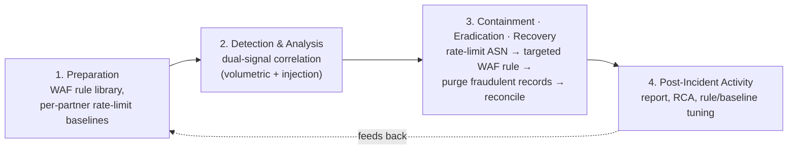
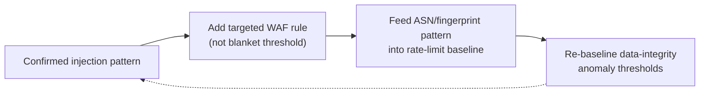

# Playbook 02 — WAF/DDoS: Data-Integrity Attack on an Ingestion API

> [!NOTE]
> Written for organizations where the ingested data is itself the product — a DDoS here isn't only an availability problem. An attacker who degrades WAF/log fidelity during a volumetric flood gets a window to inject fraudulent records that corrupt the dataset. This playbook treats availability and integrity as two risks in the same incident, not two separate ones.

**Contents:** Scenario Overview · Purpose and Scope · Risk Assessment · Policies and Procedures · Roles and Responsibilities · Incident Response Plan · Training · Continuous Improvement · Appendices

---

## 0. Scenario Overview

**Asset:** a public `/beacon/ingest` API receiving clickstream/event data from SDKs and browser extensions across many partner sites.

**Trigger — two correlated signals within 6 minutes:**
1. A scrubbing-center dashboard shows a **40× volumetric spike** (L3/L4) from a botnet-associated ASN.
2. WAF logs show a smaller, sustained **L7 wave** against the same endpoint — SQLi/parameter-tampering signatures, plus payloads shaped like legitimate events but with statistically implausible fields (reused device fingerprints, sequential fake identifiers).

**Working hypothesis:** the volumetric flood is cover — it degrades WAF rule accuracy and log completeness just enough for the L7 injection wave to launder fraudulent records past detection.



> [!TIP]
> Triaging this as pure availability — block the ASN, move on — misses the second-order risk. The volumetric noise is a plausible smokescreen for a smaller, targeted injection wave that corrupts the actual dataset. That distinction is the difference between keeping a service up and protecting what the service produces.

---

## 1. Purpose and Scope
**Purpose:** detect and contain attacks against public-facing ingestion endpoints where the real risk is data-integrity corruption, not only downtime.
**In scope:** all public ingestion/beacon APIs, the WAF and CDN/scrubbing layer, associated rate-limit and data-quality tooling.
**Out of scope:** internal-only APIs (separate east-west playbook), partner-side infrastructure (see [Playbook 05](./05-tprm-supply-chain.md)).

---

## 2. Risk Assessment

| Category | Finding |
|---|---|
| Critical assets | Ingestion API, WAF rule engine, raw event database |
| Threat actors | DDoS-for-hire operators (paid disruption), fraud actors monetizing corrupted data, competitors seeking reputational damage |
| Vulnerabilities | No statistical anomaly check on payload distribution at ingest; per-ASN rate-limit gap; WAF rule confidence degrades under volumetric noise |
| Impact | Corrupted data delivered downstream, SLA breach, inaccurate reporting, trust erosion |

**Risk score: HIGH** — confidence high (correlated dual-signal pattern rarely benign), impact high (touches the sellable product), scope actively live at detection time.

---

## 3. Policies and Procedures

### 3.1 Detection
```kql
// WAF/CDN logs — L7 injection wave riding on volumetric noise
AzureDiagnostics
| where Category == "FrontDoorWebApplicationFirewallLog"
| where TimeGenerated > ago(30m)
| where requestUri_s has "/beacon/ingest"
| summarize Requests = count(),
            Blocked = countif(action_s == "Blocked"),
            DistinctIPs = dcount(clientIP_s)
            by bin(TimeGenerated, 1m), ruleName_s
| where Requests > 500 and DistinctIPs > 200
| order by TimeGenerated asc
```
```sql
-- Data-integrity guardrail: implausible device-fingerprint reuse ratio
SELECT source_asn, COUNT(*) AS event_count,
       COUNT(DISTINCT device_fingerprint) AS distinct_devices,
       COUNT(*) * 1.0 / NULLIF(COUNT(DISTINCT device_fingerprint), 0) AS reuse_ratio
FROM ingest_events
WHERE event_time > NOW() - INTERVAL '15 minutes'
GROUP BY source_asn
HAVING COUNT(*) * 1.0 / NULLIF(COUNT(DISTINCT device_fingerprint), 0) > 50
ORDER BY event_count DESC;
```

### 3.2 Classification
| Field | This incident |
|---|---|
| Category | Availability (DDoS) + Data Integrity (fraudulent injection) |
| Severity | **P1** if integrity corruption confirmed; **P2** if volumetric-only |
| Confidence | High — dual-signal correlation |

### 3.3 Response
1. **Contain:** rate-limit/null-route the offending ASN at the scrubbing layer; deploy a **targeted** WAF rule exception for the specific injection pattern — never a blanket ruleset bypass.
2. **Eradicate:** purge confirmed-fraudulent records from the database with a full audit trail (who purged what, when, why).
3. **Recover:** run a reconciliation job against the affected time window before re-enabling full ingestion at normal thresholds.

### 3.4 Communication


> [!TIP]
> The branch point that matters most here isn't technical — it's whether a corrupted report already reached a downstream consumer. That single fact changes this from an internal fix to a disclosure conversation, so it's worth escalating that question before deep-diving the injection mechanics.

---

## 4. Roles and Responsibilities



| Role | RACI |
|---|---|
| SOC Analyst | **R** — detection, correlation, initial containment call |
| IR Lead | **A** — owns incident |
| WAF/CDN Owner | **R** — executes rate-limit/rule changes |
| Data Integrity/Product Data Owner | **R** — confirms corruption scope, runs reconciliation |
| Legal/Client Success | **C/I** — only if a shipped report is affected |

---

## 5. Incident Response Plan



---

## 6. Train and Educate
- **Tabletop:** inject a sample payload set with implausible field statistics; time-boxed triage against the [Section 3.4](#34-communication) decision tree.
- **Cross-training:** SOC pairs with the data-integrity/product-data owner regularly to calibrate what a normal traffic distribution actually looks like — a statistical anomaly can't be spotted without that baseline.

---

## 7. Continuous Improvement


---

## Appendix A — MITRE ATT&CK Mapping
| Tactic | Technique | ID |
|---|---|---|
| Impact | Network Denial of Service | T1498 |
| Initial Access | Exploit Public-Facing Application | T1190 |
| Impact | Data Manipulation: Stored Data Manipulation | T1565.001 |

## Appendix B — Severity / SLA Matrix
| Severity | Definition | SLA |
|---|---|---|
| P1 | Confirmed data-integrity corruption | Immediate |
| P2 | Volumetric-only, no integrity impact | < 30 min |
| P3 | Suspicious pattern, unconfirmed | Same shift |

## Appendix C — Design Notes / FAQ

<details>
<summary>Isn't this just a standard DDoS runbook?</summary>

The volumetric response is standard — rate-limit, scrub, block. What's non-standard is treating the flood as a possible smokescreen rather than the whole story. When the product is the data itself, always check whether the noise correlates with anything reaching the database, not just whether the service stayed up.
</details>

<details>
<summary>How do you ramp up on an unfamiliar WAF platform?</summary>

The core discipline is rule-based filtering against a known-bad pattern set, tuned to avoid false positives — the same discipline used daily with firewall/EDR rule tuning, just applied one layer up the stack, at L7 instead of L3/4. The ramp is platform-specific syntax, not the underlying judgment.
</details>

---

**Related:** [Playbook 01 — Credential Theft to Ransomware](./01-credential-theft-ransomware.md) · [Playbook 03 — CSPM Cloud Exposure](./03-cspm-cloud-exposure.md) · [Repository overview](../README.md)
