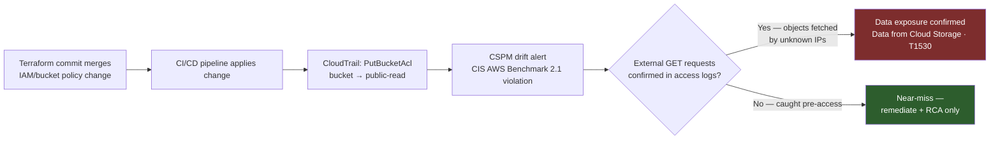
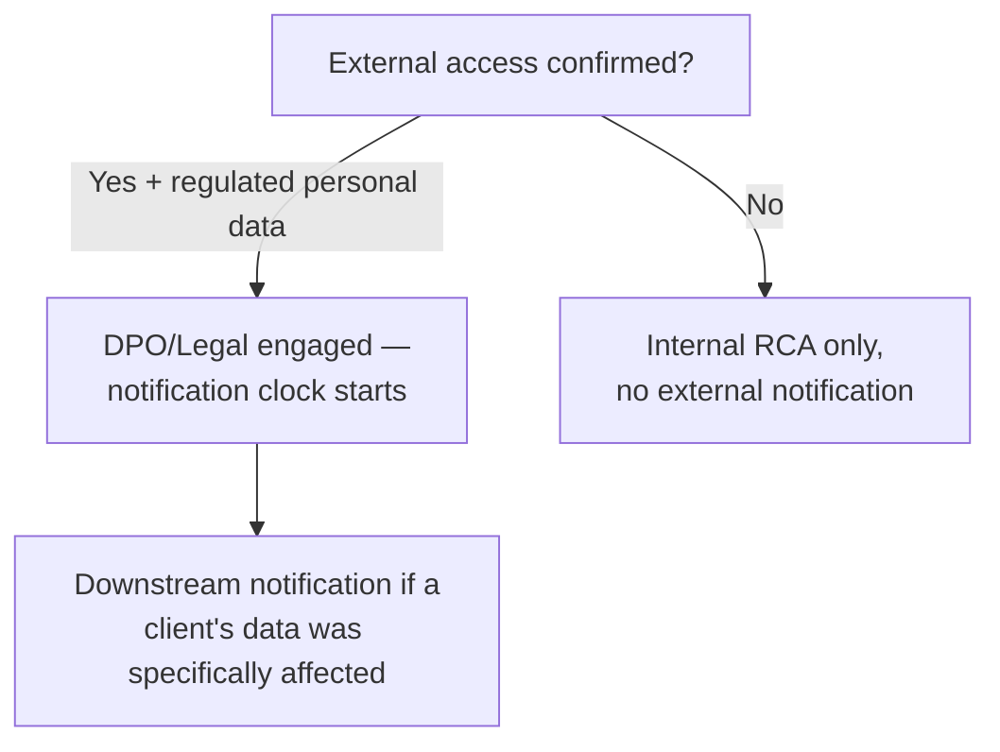
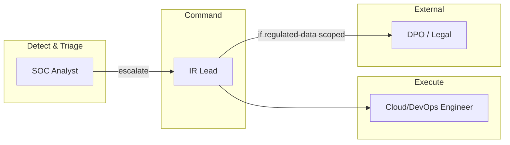
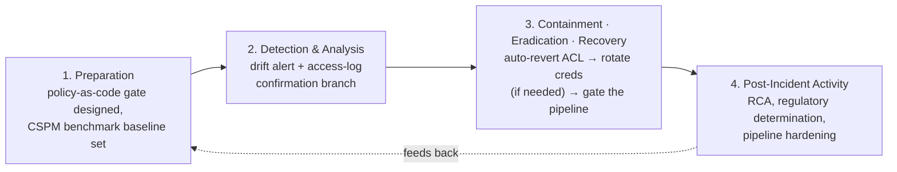
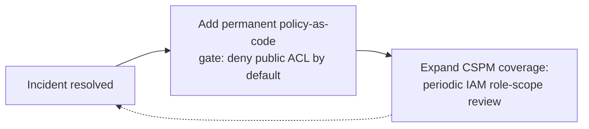

# Playbook 03 — CSPM: Misconfigured Storage Bucket Exposure

> [!NOTE]
> Built to show branching judgment, not just a remediation checklist: the same drift alert can mean either a benign configuration mistake or an active data exposure, and the correct response differs sharply between the two.

**Contents:** Scenario Overview · Purpose and Scope · Risk Assessment · Policies and Procedures · Roles and Responsibilities · Incident Response Plan · Training · Continuous Improvement · Appendices

---

## 0. Scenario Overview

**Asset:** an AWS S3 bucket storing raw event exports that feed a client-facing analytics pipeline.

**Trigger:** a CSPM tool fires a drift alert — bucket ACL changed to `public-read`. The correlated CloudTrail event, `PutBucketAcl`, was issued by the CI/CD deployment role outside its normal deployment window.

**Root-cause hypothesis — deliberately ambiguous at first:** most likely an infrastructure-as-code (Terraform) commit that mis-scoped a policy without peer review. It could also mean the CI/CD role's credentials were compromised. The response has to branch correctly on this, not assume either way.



> [!TIP]
> The first step isn't remediation — it's answering one question: did anyone outside the organization actually fetch an object while the bucket was public? That single fact is the difference between a near-miss RCA and a regulatory-notification clock starting.

---

## 1. Purpose and Scope
**Purpose:** detect cloud-configuration drift that exposes sensitive data, and correctly branch response based on confirmed-versus-unconfirmed external access.
**In scope:** all cloud storage holding sensitive/regulated data, associated IAM roles, IaC pipelines that can modify bucket policy.
**Out of scope:** application-layer vulnerabilities in the consuming dashboard itself (separate AppSec playbook).

---

## 2. Risk Assessment

| Category | Finding |
|---|---|
| Critical assets | Regulated-data bucket, CI/CD deployment role |
| Threat actors | Opportunistic bucket-scanning bots (grab exposed data within minutes of exposure), insider misconfiguration (most likely path), compromised CI/CD credentials (lower likelihood, higher impact) |
| Vulnerabilities | No org-wide S3 Block Public Access enforcement; no policy-as-code gate (OPA/Conftest) blocking public ACLs pre-merge; IAM role has broader `s3:Put*` scope than deployment actually needs |
| Impact | Regulatory notification obligation (e.g., GDPR Article 33, 72-hour clock) if personal data plus confirmed external access; reputational impact |

**Risk score:** branches — HIGH if external access is confirmed, MEDIUM (process/config gap, not a live breach) if caught pre-access.

---

## 3. Policies and Procedures

### 3.1 Detection
```kql
// CloudTrail via Sentinel — S3 bucket made public
AWSCloudTrail
| where EventName in ("PutBucketAcl", "PutBucketPolicy")
| where TimeGenerated > ago(1h)
| extend RequestParams = parse_json(RequestParameters)
| where tostring(RequestParams.["x-amz-acl"]) == "public-read"
    or tostring(RequestParams.policy) has '"Principal": "*"'
| project TimeGenerated, UserIdentityArn, SourceIPAddress, RequestParameters, EventName
```

### 3.2 Classification
| Field | This incident |
|---|---|
| Category | Cloud misconfiguration → potential data exposure |
| Severity | **P1** if external access confirmed; **P3** if near-miss |
| Confidence | High on the drift itself; branches on access-log correlation |

### 3.3 Response
1. **Contain:** auto-remediate — revert the ACL to private immediately via the CSPM's built-in guardrail. Full automation is appropriate here: reverting to a known-good state is low-risk and reversible, unlike disabling an account or isolating a host.
2. **Eradicate:** if credential compromise is suspected, rotate the CI/CD role's keys; add a policy-as-code check (OPA/Conftest) to the pipeline that hard-blocks any public-ACL change from merging in the first place.
3. **Recover:** re-run the Terraform apply with the corrected policy; confirm the CIS benchmark passes clean.

### 3.4 Communication


---

## 4. Roles and Responsibilities



| Role | RACI |
|---|---|
| SOC Analyst | **R** — drift correlation, access-log confirmation |
| IR Lead | **A** |
| Cloud/DevOps Engineer | **R** — reverts config, rotates credentials, fixes pipeline gate |
| DPO/Legal | **C → A** — only on confirmed regulated-data exposure |

---

## 5. Incident Response Plan



---

## 6. Train and Educate
- **Tabletop:** "the CSPM alert fires overnight, CloudTrail visibility is partial for the first 20 minutes — walk the branch decision without full data."
- **DevOps pairing:** SOC reviews Terraform PR templates regularly with the cloud team to catch missing policy-as-code gates before they ship, not after.

---

## 7. Continuous Improvement


---

## Appendix A — MITRE ATT&CK Mapping (Cloud Matrix)
| Tactic | Technique | ID |
|---|---|---|
| Collection | Data from Cloud Storage | T1530 |
| Persistence/Defense Evasion | Valid Accounts: Cloud Accounts | T1078.004 |
| Discovery | Cloud Service Discovery (opportunistic scanners) | T1526 |

## Appendix B — Severity / SLA Matrix
| Severity | Definition | SLA |
|---|---|---|
| P1 | Confirmed external access to public bucket | Immediate |
| P2 | Public bucket, access unconfirmed either way | < 30 min |
| P3 | Caught pre-access, config-only issue | Same shift |

## Appendix C — Design Notes / FAQ

<details>
<summary>Why auto-remediate here but not in Playbook 01's account-disable step?</summary>

Reversibility and blast radius. Reverting a bucket ACL to its known-good state has almost no downside if the trigger turns out to be a false alarm. Disabling a live account or isolating a production host can itself cause an outage. Low-risk, reversible actions can automate; high-impact, hard-to-undo actions need a human in the loop.
</details>

<details>
<summary>How would you ramp on a named CSPM platform you haven't used before?</summary>

The underlying discipline — continuous config scanning against a benchmark, triaging drift, prioritizing by exploitability — is identical to daily EDR/SIEM work. What's new is the control plane (cloud IAM/config APIs) and the specific misconfiguration classes. Hands-on Entra ID/hybrid-identity exposure already covers the cloud-control-plane side.
</details>

---

**Related:** [Playbook 02 — WAF/DDoS Data Integrity](./02-waf-ddos-data-integrity.md) · [Playbook 04 — AI Governance](./04-ai-governance-prompt-injection.md) · [Repository overview](../README.md)
