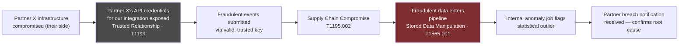
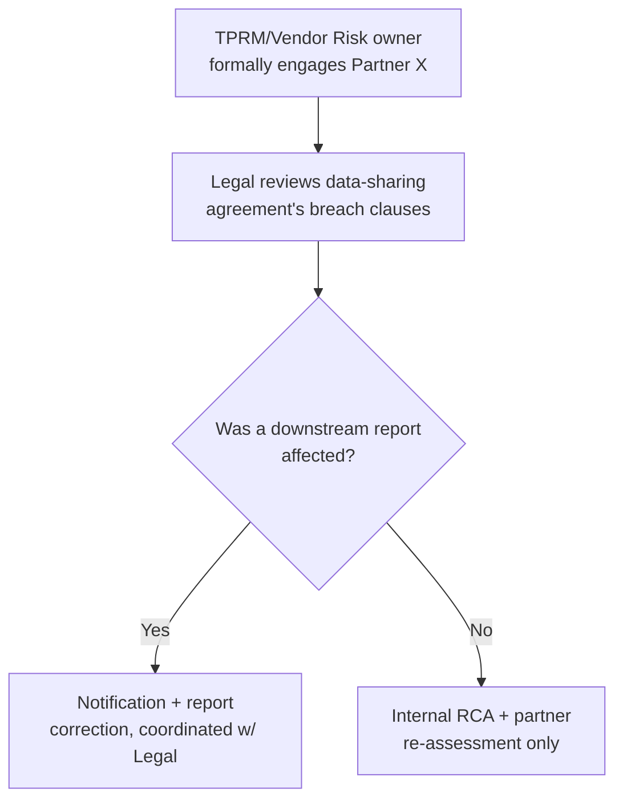
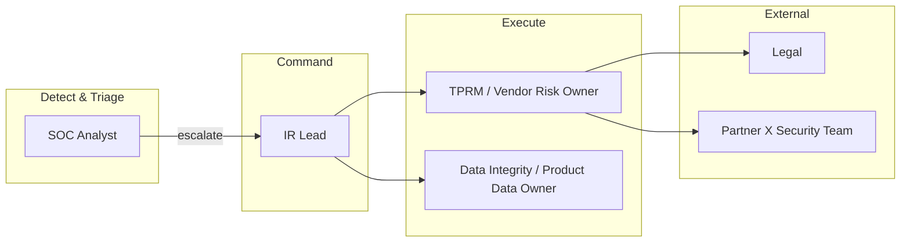
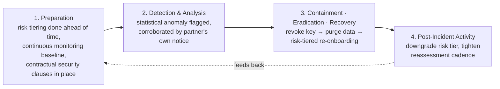
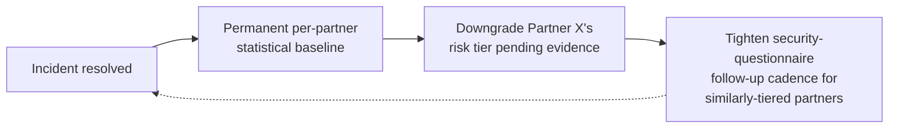

# Playbook 05 — TPRM: A Partner's Breach Becomes Your Incident

> [!NOTE]
> Written for the case where the attacker never touches your own environment — they abuse a relationship you already trusted. The response is built around vendor-management levers (key revocation, contractual clauses, risk-tiered re-assessment) as much as technical ones.

**Contents:** Scenario Overview · Purpose and Scope · Risk Assessment · Policies and Procedures · Roles and Responsibilities · Incident Response Plan · Training · Continuous Improvement · Appendices

---

## 0. Scenario Overview

**Asset:** a data aggregation pipeline that ingests event data from dozens of third-party data partners (SDK vendors, ad exchanges) under signed data-sharing agreements.

**Trigger:** an automated data-quality job flags **Partner X**'s feed showing a **12× volume spike** with near-identical event signatures (sequential device IDs, identical timestamp deltas) — a bot-farm pattern — arriving through Partner X's normally-trusted, authenticated API key. Within hours, Partner X sends a **contractual breach notification** confirming their own infrastructure was compromised roughly 36 hours earlier and their integration credentials were exposed.



> [!TIP]
> The instinct is to treat this like an internal breach — it isn't. The attacker never touched the internal environment; they abused an existing trust relationship. That reframes the whole response: there's no host to isolate, there's a key to revoke, a feed to quarantine, and half the response belongs to vendor management and legal, not the SOC alone.

---

## 1. Purpose and Scope
**Purpose:** detect and contain fraudulent or malicious data entering the pipeline through a compromised or malicious third-party partner, and coordinate the vendor-facing side of response alongside the technical side.
**In scope:** all data-sharing integrations under signed partner agreements, associated API keys and rate limits.
**Out of scope:** direct compromise of internal infrastructure (see [Playbook 01](./01-credential-theft-ransomware.md)).

---

## 2. Risk Assessment

| Category | Finding |
|---|---|
| Critical assets | Ingestion pipeline, partner API-key vault, downstream products built on the aggregated data |
| Threat actors | Compromised/malicious partner infrastructure, insufficiently-vetted lower-tier partners |
| Vulnerabilities | No per-partner statistical baseline at ingestion (only aggregate-level checks); API keys not scoped/rate-limited per partner; reassessment cadence too infrequent to catch a partner's degrading security posture between cycles |
| Impact | Corrupted data delivered downstream before detection; contractual/reputational fallout; possible client notification obligation |

**Risk score: HIGH** — confirmed supply-chain compromise with confirmed data-integrity impact on a live downstream product.

---

## 3. Policies and Procedures

### 3.1 Detection
```sql
-- Per-partner anomaly check on the ingestion pipeline
SELECT partner_id,
       COUNT(*) AS event_count_1h,
       AVG(COUNT(*)) OVER (
           PARTITION BY partner_id
           ORDER BY date_hour
           ROWS BETWEEN 168 PRECEDING AND 1 PRECEDING
       ) AS baseline_7d_avg,
       COUNT(*) * 1.0 / NULLIF(AVG(COUNT(*)) OVER (
           PARTITION BY partner_id
           ORDER BY date_hour
           ROWS BETWEEN 168 PRECEDING AND 1 PRECEDING
       ), 0) AS spike_ratio
FROM partner_ingestion_events
WHERE event_time > NOW() - INTERVAL '1 hour'
GROUP BY partner_id, date_hour
HAVING spike_ratio > 8
ORDER BY spike_ratio DESC;
```

### 3.2 Classification
| Field | This incident |
|---|---|
| Category | Supply-chain / trusted-relationship compromise → data integrity |
| Severity | **P1** — confirmed compromise plus confirmed impact on a downstream product |
| Confidence | High — internal statistical detection independently corroborated by the partner's own breach notice |

### 3.3 Response
1. **Contain:** revoke/rotate Partner X's API key immediately; quarantine their feed from the aggregation pipeline pending review.
2. **Eradicate:** identify and purge the specific fraudulent event window from the dataset — full audit trail, the same compliance-evidence-mapping discipline used for SOC 2/ISO 27001 documentation.
3. **Recover:** re-onboard the partner only after they provide remediation evidence (pentest report, attestation) — a risk-tiered decision, not an automatic permanent ban or an automatic reinstatement.

### 3.4 Communication


---

## 4. Roles and Responsibilities



| Role | RACI |
|---|---|
| SOC Analyst | **R** — statistical detection, initial containment recommendation |
| IR Lead | **A** |
| TPRM/Vendor Risk Owner | **R** — key revocation, partner engagement, re-assessment decision |
| Data Integrity/Product Data Owner | **R** — scopes and purges corrupted data |
| Legal | **C** — contract clauses, notification obligation |

---

## 5. Incident Response Plan



> [!TIP]
> Most of the real work in a mature TPRM program happens in Preparation, before any incident — risk-tiering, contractual clauses, monitoring cadence. By the time Detection & Analysis starts, half the options were already decided months earlier. That's the difference between treating TPRM as an incident response and treating it as a standing program.

---

## 6. Train and Educate
- **Tabletop:** "a partner just emailed a breach notice for an integration nobody remembered was still active" — surfaces the partner-inventory gap the same way [Playbook 04](./04-ai-governance-prompt-injection.md) surfaces "shadow AI."
- **Cross-training:** SOC reviews the current partner risk-tier list regularly with the TPRM owner so alerts can be triaged against actual partner criticality, not treated uniformly.

---

## 7. Continuous Improvement


---

## Appendix A — MITRE ATT&CK Mapping
| Tactic | Technique | ID |
|---|---|---|
| Initial Access | Trusted Relationship | T1199 |
| Initial Access | Supply Chain Compromise: Software Supply Chain | T1195.002 |
| Impact | Data Manipulation: Stored Data Manipulation | T1565.001 |

## Appendix B — Severity / SLA Matrix
| Severity | Definition | SLA |
|---|---|---|
| P1 | Confirmed compromise plus confirmed integrity impact on a live product | Immediate |
| P2 | Confirmed anomaly, partner compromise unconfirmed | < 60 min |
| P3 | Statistical anomaly only, plausible benign explanation exists | Same shift |

## Appendix C — Design Notes / FAQ

<details>
<summary>How do you risk-tier a partner in the first place?</summary>

By criticality × data access — a partner receiving raw, individual-level data warrants far more scrutiny than one receiving aggregated public metrics. Request evidence, not just a questionnaire answer: a current SOC 2 report, ISO 27001 certification, a recent pentest summary — the same evidence-gathering discipline used supporting SOC 2/GDPR/HIPAA audits.
</details>

<details>
<summary>What if you've only supported compliance-evidence gathering, not owned vendor risk assessments end-to-end?</summary>

That's a fair distinction to be upfront about. What this playbook demonstrates is understanding the full process well enough to operate at that level: risk-tiering, evidence-based review, and continuous reassessment rather than a one-time check. The gap is authority and repetition, not comprehension of the process.
</details>

---

**Related:** [Playbook 04 — AI Governance](./04-ai-governance-prompt-injection.md) · [Playbook 01 — Credential Theft to Ransomware](./01-credential-theft-ransomware.md) · [Repository overview](../README.md)
