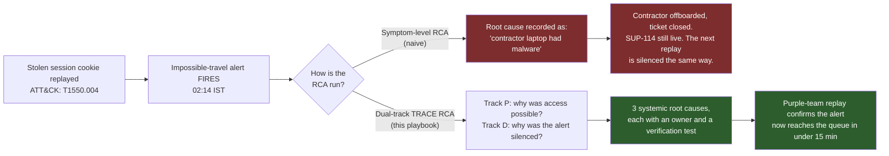
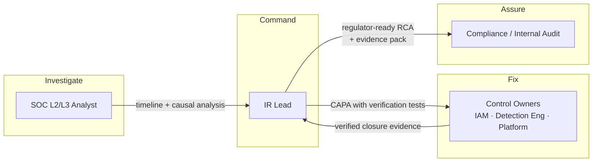
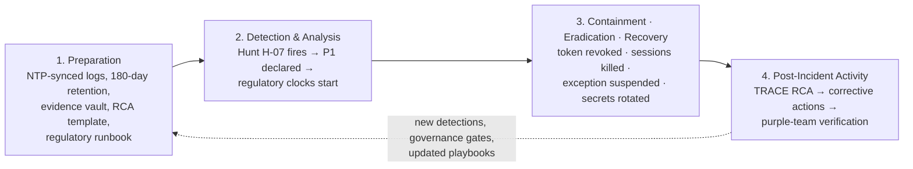
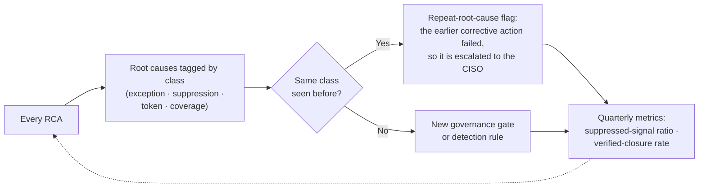

# Playbook 06 — Root Cause Analysis: The Alert That Fired and Was Silenced

> [!NOTE]
> Most RCAs answer *"how did they get in?"* This one also asks *"our control saw it, so why didn't we?"* It uses the **TRACE** method (Timeline · Reason · Adversary · Controls · Evidence & Enforcement) from the [trace-rca-playbook](https://github.com/CdxDebian/trace-rca-playbook) project. The CERT-In and SEBI reporting clocks run alongside the analysis instead of waiting for it.

**Contents:** Scenario Overview · Purpose and Scope · Risk Assessment · Policies and Procedures · Roles and Responsibilities · Incident Response Plan · Training · Continuous Improvement · Appendices

---

## 0. Scenario Overview

**Asset:** the firm's internal Git platform, which holds proprietary research, execution logic and gateway configuration. For a trading firm this is the crown jewel, and it matters more than any single customer record.

**Trigger:** an infostealer on a contractor's **unmanaged personal laptop** harvests an SSO session cookie. At 02:14 IST the attacker replays it from a hosting-provider ASN. MFA is never prompted because the token already carries the MFA claim. The attacker creates a non-expiring personal access token and clones **14 repositories (~3.1 GB)** in about 70 minutes.

**The twist:** an impossible-travel alert **fired at 02:14**. It was auto-closed within 30 seconds by suppression rule `SUP-114`, an allowlist covering a whole hosting-provider ASN range. The rule had been created a year earlier to cut noise, and it had no owner and no expiry.

**Outcome:** a scheduled threat hunt catches the bulk clone at **06:48 IST**, which is **4h34m** after the alert was silenced. Containment follows in 17 minutes. CERT-In and SEBI are notified at 2h52m, well inside the 6-hour clock.



> [!TIP]
> Both RCAs close the ticket, but only one of them closes the gap. The naive RCA blames something outside the organisation's control, so it produces no fix. The dual-track RCA finds that **the detection worked and the governance around it did not**, and that failure lets every future variant of this attack through, whatever the entry point.

---

## 1. Purpose and Scope
**Purpose:** make every post-incident review produce a **systemic, controllable, verified** fix. The review must analyse detection failures with the same rigour as prevention failures, and it must deliver regulator-ready output on time.
**In scope:** every incident of Medium severity or above, every incident reportable to CERT-In or SEBI, and every near-miss where a control failed silently (fired and suppressed, excluded, or out of coverage).
**Out of scope:** live containment decisions, which are covered by the relevant response playbook ([Playbook 04](./04-ai-governance-prompt-injection.md) for AI surfaces, for example). RCA begins once containment is achieved, or 72 hours after detection, whichever comes first.

---

## 2. Risk Assessment

| Category | Finding |
|---|---|
| Critical assets | Proprietary source code and research, gateway and execution configuration, secrets embedded in repositories |
| Threat actors | Infostealer-log buyers and initial-access brokers who target third-party identities because contractor devices often sit outside EDR coverage |
| Vulnerabilities | Security **exceptions without expiry**, **suppressions without owners**, session tokens not bound to a device, non-expiring personal access tokens. All of these are "temporary" decisions that became permanent attack surface |
| Impact | IP loss that erodes a trading edge, regulatory exposure under SEBI CSCRF and CERT-In, and a repeat incident if the RCA stops at the symptom |

**Risk score:** this incident alone is HIGH (confirmed IP exfiltration). As a class, **unowned suppressions and exceptions** are HIGH and cut across every domain, because each one is a silent blind spot that no dashboard shows. That is why this playbook treats detection-content governance as a standing control rather than a one-off clean-up.

---

## 3. Policies and Procedures

### 3.1 Governance Logic — Two Gates

The RCA produced two policy-as-code gates. The first stops the root cause from recurring. The second stops the RCA itself from closing on paper only.

```python
# Gate 1 — Suppression hygiene: runs in CI on every detection-content change
# and nightly against the live SIEM. Outcomes: PASS / WARN / FAIL.

MAX_SUPPRESSION_DAYS = 90
BROAD_MATCH_FIELDS = {"asn", "country", "cidr_/8", "cidr_/16", "user_agent_family"}

def lint_suppression(rule: dict, today) -> str:
    if not rule.get("owner"):                              # SUP-114 failed here
        return "FAIL"
    if rule.get("expiry") is None:                         # ...and here
        return "FAIL"
    if (rule["expiry"] - rule["created"]).days > MAX_SUPPRESSION_DAYS:
        return "FAIL"
    if rule.get("match_field") in BROAD_MATCH_FIELDS:      # ...and here
        return "WARN"                                      # needs peer review + justification
    if rule["expiry"] < today:
        return "FAIL"                                      # expired rules are removed, not renewed silently
    return "PASS"


# Gate 2 — RCA closure: a root cause or corrective action cannot be accepted
# until it meets the stop-rule and carries proof that the fix works.

def accept_root_cause(rc: dict) -> bool:
    return (rc["systemic"]            # a policy, control, process or design gap, never a person
            and rc["controllable"]    # within our authority to change
            and rc["actionable"]      # at least one corrective action is written against it
            and bool(rc["evidence_ids"]))

def close_capa(capa: dict) -> str:
    if capa["status"] != "Implemented":
        return "OPEN"
    if not capa.get("verification_result", "").startswith("PASS"):
        return "OPEN"                 # "Implemented" is not "fixed"
    return "VERIFIED"                 # the only status that counts as closed
```

### 3.2 Classification

| Field | This incident |
|---|---|
| Category | Identity compromise → IP exfiltration, with a **suppressed detection** (silent control failure) |
| Severity | **P1**. Data left the boundary, and proprietary IP was involved |
| RCA type | Full TRACE RCA, submitted to the regulator (see Appendix B) |
| Confidence | High. Every timeline row cites a SHA-256-hashed evidence artefact, and the manifest verifies intact |

### 3.3 Response — Running the RCA

1. **Kick-off (≤ 1 h after trigger):** state the RCA question in one sentence: *"Why could an unmanaged device reach source code, and why did detection take 4h34m after the alert fired?"* Preserve evidence, extend log retention, and confirm the regulatory clocks already started at 06:48.
2. **T — Timeline:** follow the rule of one fact per row, and give every row a source and an evidence ID. Normalise timezones by code, never by hand. **Include the suppressed alert as a timeline row.** It is the most important row in this RCA.
3. **R — Reason (dual-track 5 Whys):**
   - *Track P, prevention:* cookie replay → no device binding → exception `CA-EXC-09` → no expiry or review → **RC-1: no exception governance.** A branch from the same track gives **RC-3: non-expiring personal access tokens without step-up authentication.**
   - *Track D, detection:* alert fired → auto-closed → ASN-wide allowlist → never revisited → **RC-2: no suppression governance, and suppressed volume never measured.**
4. **A — Adversary:** map each ATT&CK technique to a detection opportunity and record whether it fired. Record what the attacker **failed** to do (no writes, no access to the trading network). Those negative findings bound the blast radius for the regulator.
5. **C — Controls:** build the failure matrix, and list the **controls that worked** (hunt H-07, the SOAR containment playbook, the reporting runbook) so that leadership does not over-correct.
6. **E — Evidence & Enforcement:** assemble the hash-chained evidence pack and the corrective-action register. Each action has a named owner, a due date and a verification test. It closes only when Gate 2 returns `VERIFIED`.

### 3.4 Communication

| Audience | What they get | When |
|---|---|---|
| CERT-In | Incident report with the facts known so far, labelled preliminary | ≤ 6 h from detection |
| SEBI / exchange | Early email alert; portal report in the prescribed format | ≤ 6 h / ≤ 24 h |
| SEBI | Full RCA: exact cause (including the vendor-side cause), chronology, impacted systems, and corrective/preventive measures | Per CSCRF Annexure-O timeline |
| Leadership | One page: what happened, business impact, root causes in plain language, top 3 actions | Day 3 |
| Detection engineering | New rules committed, suppressions re-audited | Within CAPA due dates |

> [!IMPORTANT]
> Reporting never waits for the RCA. Early notifications use verified facts only. Do not speculate about the cause before the analysis supports it.

---

## 4. Roles and Responsibilities



| Role | RACI |
|---|---|
| SOC L2/L3 Analyst | **R** — builds the timeline, runs the dual-track analysis, maps ATT&CK |
| IR Lead | **A** — owns the RCA question, signs off root causes, drives the regulatory clocks |
| Control Owners | **R** — implement and verify corrective actions |
| Compliance | **C** — reviews regulator wording; **A** for submissions |
| Internal Audit | **C/I** — independently re-derives the conclusions from the evidence pack alone |
| CISO | **I** during the RCA; **A** for final closure |

---

## 5. Incident Response Plan



---

## 6. Train and Educate
- **Tabletop, "the silent alert":** give the team a timeline that contains an auto-closed alert. The test is whether the team finds the suppressed row and treats it as root-cause material, rather than only asking how the attacker got in.
- **RCA writing drill:** analysts rewrite three real root-cause statements that blame a person or an external factor until each passes the stop-rule.
- **Awareness:** anyone who creates a suppression or a control exception learns that they own it, that it expires, and that it will be reviewed.

---

## 7. Continuous Improvement


---

## Appendix A — MITRE ATT&CK Mapping

| Tactic | Technique | ID | Detection opportunity | Fired? |
|---|---|---|---|---|
| Credential Access | Steal Web Session Cookie | T1539 | Real-time infostealer-log TI matching | No (daily batch) |
| Defense Evasion / Lateral Movement | Use Alternate Authentication Material: Web Session Cookie | T1550.004 | Impossible travel; ASN change mid-session | **Fired, then suppressed** |
| Persistence | Account Manipulation: Additional Cloud Credentials | T1098.001 | Token creation within 60 min of a risky sign-in | No rule |
| Collection | Data from Information Repositories: Code Repositories | T1213.003 | Clone volume vs the user's own baseline | Hunt only |
| Exfiltration | Exfiltration Over Web Service | T1567 | Egress volume per identity | No rule |

## Appendix B — RCA Severity / SLA Matrix

| Severity | Definition | RCA depth | RCA due |
|---|---|---|---|
| P1 | Data or IP left the boundary, **or** a regulator-reportable incident | Full TRACE plus a regulator report | Draft in 10 business days; submitted per CSCRF timeline |
| P2 | Contained before impact, but a control failed or was bypassed | Full TRACE, internal | 15 business days |
| P3 | Near-miss: a control fired but was suppressed, excluded or out of coverage, with no adversary progress | Lightweight dual-track 5 Whys | 30 days |

> [!NOTE]
> Regulatory timelines vary by regulated-entity category and are revised periodically. Confirm them against the current CERT-In directions, SEBI CSCRF Annexure-O and the exchange circulars before relying on them.

## Appendix C — Regulatory Clock Board

| Obligation | Starts at | Deadline | Met in this incident? |
|---|---|---|---|
| CERT-In incident report | Detection (06:48) | 6 h → 12:48 | ✅ 09:40 |
| SEBI email alert | Detection | 6 h | ✅ 09:40 |
| SEBI portal report | Detection | 24 h | ✅ 21:30 |
| Full RCA to SEBI | Detection | Per Annexure-O | ⏳ In progress |

## Appendix D — Design Notes / FAQ

<details>
<summary>Why not just record "the contractor's laptop was infected" as the root cause?</summary>

That statement is true, but it doesn't help. The firm can't control a third party's personal device, so no corrective action can be written against it. The stop-rule asks for the deepest cause that is **systemic, controllable and actionable**. Here that cause is the exception that let an unmanaged device reach source code in the first place. The contractor's device appears in the report as a **vendor-side cause**, because SEBI expects vendor causes to be stated explicitly, but it is not where the analysis stops.
</details>

<details>
<summary>Wasn't SUP-114 a reasonable decision when it was made?</summary>

Yes, and saying so is what keeps the RCA blameless. Cutting noise from a known contractor VPN was a sound call at the time. The failure was that **nothing forced anyone to revisit it**: it had no owner, no expiry and no metric on how much it was hiding. The fix is governance (Gate 1), not blaming whoever wrote the rule.
</details>

<details>
<summary>How do you stop teams treating suppression governance as friction?</summary>

Make the easy path the governed one. A suppression that is owned, expiring and narrowly matched sails through Gate 1 automatically. Only broad or ownerless rules trigger a review. Then show the weekly suppressed-signal report: once a team sees how many alerts its "temporary" rule has hidden, the conversation changes quickly.
</details>

<details>
<summary>Where does AI fit in this RCA?</summary>

It fits as a drafting tool and never as the decision-maker. An LLM can summarise alert clusters, suggest ATT&CK candidates and translate findings into regulator language. It does not declare the root cause, classify severity or write submitted text unreviewed. Log content is treated as untrusted input, the same evidence-boundary principle as [Playbook 04](./04-ai-governance-prompt-injection.md), because an attacker can plant instructions in a username or a commit message.
</details>

---

**Related:** [Playbook 04 — AI Governance: Prompt Injection](./04-ai-governance-prompt-injection.md) · [Playbook 05 — TPRM Supply Chain](./05-tprm-supply-chain.md) · [TRACE RCA toolkit](https://github.com/CdxDebian/trace-rca-playbook) · [Repository overview](../README.md)
