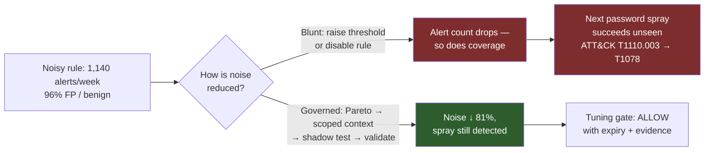
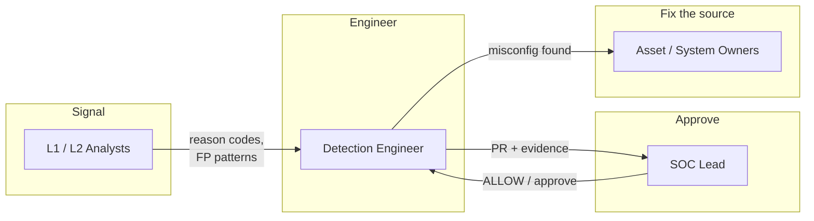
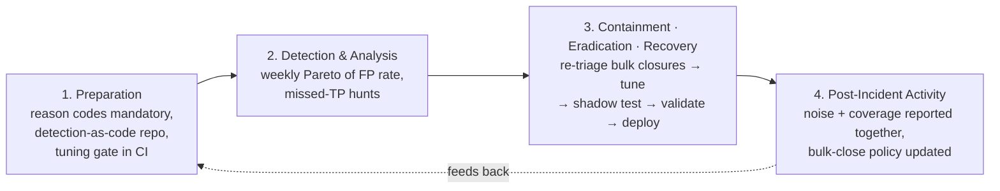
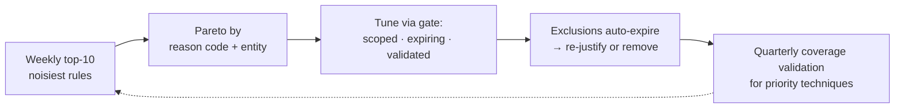

# Playbook 08 — SIEM Tuning: Cutting Alert Fatigue Without Losing Coverage

> [!NOTE]
> Noise is not a nuisance — it's a vulnerability. Every false positive spends analyst attention the next true positive needed. This playbook is built from the tuning discipline that cut false positives by 20–40% across Splunk, Sentinel and Chronicle in a production SOC: **add context, never subtract coverage.** It pairs with [Playbook 06](./06-root-cause-analysis-silent-suppression.md), which covers what happens when a suppression goes wrong.

**Contents:** Scenario Overview · Purpose and Scope · Risk Assessment · Policies and Procedures · Roles and Responsibilities · Incident Response Plan · Training · Continuous Improvement · Appendices

---

## 0. Scenario Overview

**Asset:** the SOC's detection library and the analysts' attention.

**Trigger:** the weekly detection review shows the rule *"Multiple failed sign-ins followed by success"* produced **1,140 alerts in 7 days, 96% closed as false or benign positive**. During a bulk-close, an analyst closed 40 alerts at once. One of them was a password-spray success against a service account (T1110.003), found 9 days later during a hunt.

**Outcome:** the rule is tuned through the governed path below — noise down 81%, the spray pattern still fires in validation, and bulk-close is restricted.



> [!TIP]
> Both paths make the dashboard look better on Monday. Only one of them is still true on the day an attacker shows up. The test of a tuning change is not *"did alerts go down?"* but *"does the attack it was written for still fire?"*

---

## 1. Purpose and Scope
**Purpose:** reduce false positives in a measurable, reversible, reviewed way that preserves — and proves — detection coverage.
**In scope:** SIEM analytics rules, EDR custom detections, UEBA thresholds, exclusions, allowlists, suppression windows and severity changes.
**Out of scope:** onboarding new log sources (see [Playbook 10](./10-telemetry-silence-log-source-health.md)) and post-incident RCA of a missed detection (see [Playbook 06](./06-root-cause-analysis-silent-suppression.md)).

---

## 2. Risk Assessment

| Category | Finding |
|---|---|
| Critical assets | Detection coverage of priority ATT&CK techniques; analyst attention and morale |
| Threat actors | Any adversary benefiting from buried alerts; attackers who deliberately create noise or abuse known exclusions (e.g., naming tools after allowlisted processes) |
| Vulnerabilities | Rules written for another environment and never baselined; global exclusions with no owner or expiry; bulk-close without sampling; closure without reason codes, so tuning has no data |
| Impact | Missed true positives, rising MTTD, analyst burnout and attrition, audit findings on monitoring effectiveness |

**Risk score:** current state — **HIGH** (a confirmed missed TP). After governed tuning — **MEDIUM → LOW** as reason-code data matures.

---

## 3. Policies and Procedures

### 3.1 Detection and Governance Logic

```kql
// Sentinel — false-positive rate per analytic rule, last 30 days
SecurityIncident
| where TimeGenerated > ago(30d)
| summarize arg_max(TimeGenerated, *) by IncidentNumber          // latest state per incident
| where Status == "Closed"
| summarize Total = count(),
            FP = countif(Classification in ("FalsePositive", "BenignPositive"))
            by Title
| extend FP_Rate = round(100.0 * FP / Total, 1)
| where Total >= 20
| order by FP desc
| take 10                                                        // the Pareto top-10
```

```spl
# Splunk ES equivalent — adjust the disposition field to your ES version
index=notable earliest=-30d status_label="Closed"
| stats count as total count(eval(match(disposition_label,"(?i)false|benign"))) as fp by rule_name
| eval fp_rate=round(100*fp/total,1)
| where total>=20 | sort - fp | head 10
```

```python
# Tuning gate — policy-as-code for every proposed tuning change (runs in the
# detection-as-code PR pipeline). Outcomes: ALLOW / REQUIRE_APPROVAL / BLOCK

def evaluate_tuning_change(change: dict) -> str:
    if change["type"] == "disable_rule" and change["maps_to_priority_technique"] \
            and not change.get("replacement_rule"):
        return "BLOCK"                     # never remove coverage without a replacement
    if change["type"] == "exclusion" and change["scope"] in ("global", "process_name_only"):
        return "BLOCK"                     # attackers can name a binary anything
    if not change.get("expiry_days") or change["expiry_days"] > 90:
        return "BLOCK"                     # every exclusion expires and is re-justified
    if not change.get("validation_evidence"):
        return "BLOCK"                     # no proof the attack still fires → no merge
    if change.get("touches_privileged_accounts") or change.get("threshold_multiplier", 1) > 2:
        return "REQUIRE_APPROVAL"          # SOC lead signs off
    return "ALLOW"                         # scoped, expiring, validated
```

### 3.2 Classification
| Field | This incident |
|---|---|
| Category | Detection quality — noisy rule with a confirmed missed true positive |
| Severity | **P2** (missed TP on a service account; no evidence of follow-on activity after a 30-day hunt). A noisy rule *without* a missed TP is **P3** |
| Confidence | High — closure history, reason codes and the hunt finding align |

### 3.3 Response — The Tuning Workflow
1. **Contain the blast radius:** reopen and re-triage every bulk-closed alert from this rule in the last 30 days; reset the spray-targeted service account; hunt for follow-on sign-ins.
2. **Find the noise drivers (Pareto):** group the 30-day FPs by reason code and entity. Here, three sources produced 78% of the noise: a vulnerability scanner's service account, a misconfigured backup job retrying stale credentials, and VPN users after password rotation.
3. **Choose the least-coverage-costly technique for each driver:**

| Technique | Use when | Coverage cost |
|---|---|---|
| Fix the source | The benign activity is itself a misconfiguration (stale backup credentials) | None — best option |
| Scoped exclusion (entity + condition + expiry) | Known-good actor with a stable pattern (scanner account from scanner IP) | Very low |
| Watchlist context (enrich, don't exclude) | Benign-but-variable activity (post-rotation VPN failures) | None |
| Correlate with a second signal | Single signal is weak (failures + success **and** new ASN or new device) | Low |
| Per-entity baseline threshold | Volume varies by user or host | Low–medium |
| Split rule: high-fidelity alert + hunting query | Behaviour is sometimes malicious but rarely urgent | Medium — needs a hunting cadence |
| Raise global threshold / disable | Almost never | High — requires replacement |

4. **Shadow-test:** run the tuned rule against the last 30 days of data alongside the old one; compare alert counts and confirm the known TP still matches.
5. **Validate:** replay a password-spray simulation (e.g., an Atomic Red Team test for T1110.003 in a lab tenant) and confirm the alert fires end-to-end.
6. **Deploy via PR:** the change, its Pareto evidence, shadow-test result and validation screenshot go through the tuning gate.
7. **Fix the process:** bulk-close now requires sampling (open at least 3 random alerts first) and a reason code.

### 3.4 Communication
Analysts who supplied reason codes see the result — the fastest way to keep reason-code quality high. The SOC lead reports noise reduction **and** coverage status together, never one without the other. Asset owners are told when their system was a noise driver (the backup job) so the fix sticks.

---

## 4. Roles and Responsibilities



| Role | RACI |
|---|---|
| L1 / L2 Analysts | **R** — reason-coded closures; flag noisy rules |
| Detection Engineer | **R** — Pareto analysis, tuning, shadow test, validation |
| SOC Lead | **A** — approves REQUIRE_APPROVAL changes; owns coverage metrics |
| Asset / System Owners | **C** — fix noisy sources at origin |
| Threat Intelligence | **C** — confirms whether a technique is a current priority before coverage trade-offs |

---

## 5. Incident Response Plan



---

## 6. Train and Educate
- **Analysts:** "a closure is a data point" — reason codes are how tuning happens; vague codes like *Other* are rejected in review.
- **Tabletop:** give the team a 1,000-alert queue with one buried TP and a 30-minute timer. Then repeat with the tuned rule. The difference in who finds the TP is the training.
- **Detection engineers:** shadow-testing and validation are part of the change, not optional extras.

---

## 7. Continuous Improvement


**Metrics reported together:** FP rate per rule · alerts per analyst per shift · MTTA/MTTD · % priority techniques with validated detection · open exclusions by age.
**Target for this rule:** ≥ 50% noise reduction with **zero** loss in validated coverage. Achieved: 81% reduction, spray detection validated.

---

## Appendix A — Framework Mapping

| Framework | Item | Relevance |
|---|---|---|
| MITRE ATT&CK | Brute Force: Password Spraying — T1110.003 | The behaviour the noisy rule exists to catch |
| MITRE ATT&CK | Valid Accounts — T1078 | What a missed spray turns into |
| MITRE ATT&CK | Impair Defenses: Disable or Modify Tools — T1562.001 | Attackers abusing known exclusions/allowlists |
| NIST CSF 2.0 | DE.CM (continuous monitoring) · DE.AE (adverse event analysis) | Detection quality |
| ISO/IEC 27001:2022 | A.8.15 Logging · A.8.16 Monitoring activities | Monitoring effectiveness evidence |
| SEBI CSCRF | Detect function — SOC efficacy | Tuning records evidence a functioning SOC |

## Appendix B — Severity / SLA Matrix
| Severity | Definition | SLA |
|---|---|---|
| P1 | Tuning change found to have hidden an active intrusion | Immediate rollback + IR |
| P2 | Noisy rule with a confirmed missed TP | Re-triage in 24 h; tuned within 5 business days |
| P3 | Rule with FP rate > 80% and > 50 alerts/week, no missed TP | Tuned within 15 business days |
| P4 | Minor noise, exclusion renewals | Next weekly review |

## Appendix C — Design Notes / FAQ

<details>
<summary>Why not just raise the threshold from 5 failures to 20?</summary>

Because password spraying is designed to stay under thresholds — a few attempts per account, spread across many accounts. A higher per-account threshold removes exactly the signal you need. Context (who, from where, which device) reduces noise without touching that signal.
</details>

<details>
<summary>Why must every exclusion expire?</summary>

Environments change: the scanner gets decommissioned, the service account gets reused. A permanent exclusion becomes a permanent blind spot nobody remembers creating. A 90-day expiry forces someone to confirm it's still true.
</details>

<details>
<summary>Should bulk-close be banned?</summary>

No — on a genuinely noisy day it's necessary. It should require sampling a few alerts first and a reason code, and it should never be available on high-severity rules. The goal is friction proportional to risk.
</details>

<details>
<summary>When is deleting a rule the right answer?</summary>

When it detects nothing that matters in your environment, or a better rule fully covers the same technique. Deletion goes through the same gate: name the replacement or document why the technique is out of scope.
</details>

---

**Related:** [Playbook 06 — RCA: The Alert That Fired and Was Silenced](./06-root-cause-analysis-silent-suppression.md) · [Playbook 10 — Telemetry Silence](./10-telemetry-silence-log-source-health.md) · [Repository overview](../README.md)
