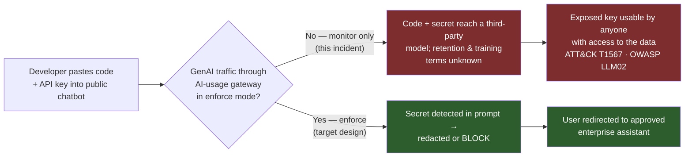
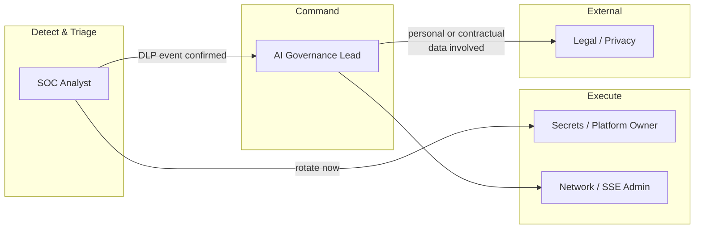
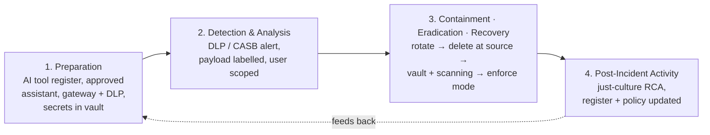
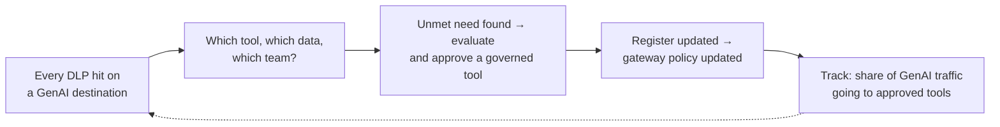

# Playbook 09 — AI Governance: Shadow AI and Sensitive-Data Leakage

> [!NOTE]
> Most AI data leaks aren't attacks — they're a capable employee trying to work faster with the wrong tool. Banning GenAI doesn't stop that; it just moves it to personal devices where you see nothing. This playbook treats **an approved, governed alternative as the primary control** and DLP as the safety net, with a just-culture response that fixes the system rather than punishing the person.

**Contents:** Scenario Overview · Purpose and Scope · Risk Assessment · Policies and Procedures · Roles and Responsibilities · Incident Response Plan · Training · Continuous Improvement · Appendices

---

## 0. Scenario Overview

**Asset:** proprietary source code for an internal order-routing service, and a live API key for an external market-data provider that was hard-coded in it.

**Trigger:** the secure web gateway's DLP policy — running in *monitor* mode for GenAI destinations — flags an upload from a developer's laptop to a consumer-tier public chatbot: 600 lines of Python containing a string matching an API-key pattern. The developer was debugging a latency issue late at night; the approved enterprise assistant had not yet been rolled out to their team.

**Outcome:** key rotated within 47 minutes, conversation deleted at source, DLP switched to block-and-coach for secrets, and the approved assistant rolled out to the team within a week.



> [!TIP]
> Once a secret has crossed the boundary, deleting the chat is housekeeping — **rotation is the containment.** Treat any secret pasted into an external AI tool exactly like a secret pushed to a public repo.

---

## 1. Purpose and Scope
**Purpose:** let staff use GenAI productively while preventing sensitive data — source code, secrets, personal data, confidential business data — from reaching unapproved AI services, and respond fast when it does.
**In scope:** public GenAI chat services, AI browser extensions, AI coding assistants, AI features embedded in SaaS tools, and personal accounts on approved tools.
**Out of scope:** prompt-injection attacks against internal copilots ([Playbook 04](./04-ai-governance-prompt-injection.md)) and pre-launch security testing of internal AI systems ([Playbook 07](./07-ai-pentesting-llm-red-team.md)).

---

## 2. Risk Assessment

| Category | Finding |
|---|---|
| Critical assets | Source code and trading logic, secrets and API keys, personal data (employee and customer), unreleased business information |
| Threat actors | Primarily **well-intentioned employees**; secondarily malicious insiders using AI tools as an exfiltration path; third parties who later access the AI provider's stored data |
| Vulnerabilities | No approved alternative (the root cause of most shadow AI); consumer tiers whose terms may allow retention or training on inputs; extensions with "read all pages" permission; secrets hard-coded in source; DLP in monitor-only mode |
| Impact | IP exposure, credential compromise, personal-data breach obligations (e.g., India's DPDP Act), contractual breaches with data providers, regulatory scrutiny |

**Risk score:** this incident — **HIGH** (live credential exposed). As a standing risk without a governed alternative — **HIGH**; with an approved tool plus enforce-mode DLP — **MEDIUM–LOW**.

---

## 3. Policies and Procedures

### 3.1 Detection and Gateway Logic

```kql
// Defender for Endpoint — uploads to GenAI domains by user and volume
// (maintain the domain list as a watchlist; this sample is illustrative)
let GenAI = dynamic(["chat.openai.com","chatgpt.com","gemini.google.com","claude.ai","perplexity.ai","copilot.microsoft.com"]);
DeviceNetworkEvents
| where Timestamp > ago(7d)
| where RemoteUrl has_any (GenAI)
| summarize Connections = count(), Devices = dcount(DeviceName) by InitiatingProcessAccountName, RemoteUrl
| order by Connections desc
```

```python
# AI-usage gateway — policy-as-code evaluated on every prompt or upload
# to a GenAI destination. Outcomes: ALLOW / REQUIRE_APPROVAL / BLOCK

def evaluate_genai_request(destination: str, content_labels: set, user_group: str) -> str:
    tier = AI_TOOL_REGISTER.get(destination, "UNAPPROVED")   # APPROVED / TOLERATED / UNAPPROVED
    if "SECRET" in content_labels:
        return "BLOCK"                 # secrets never leave, to any tool — redact and coach
    if tier == "UNAPPROVED":
        return "BLOCK"                 # with a link to the approved alternative
    if {"SOURCE_CODE", "PERSONAL_DATA", "CONFIDENTIAL"} & content_labels:
        if tier == "APPROVED":         # enterprise contract: no training, retention controls
            return "ALLOW"
        return "REQUIRE_APPROVAL"      # justification prompt, logged for review
    return "ALLOW"                     # public-safe content on approved or tolerated tools
```

### 3.2 Classification
| Field | This incident |
|---|---|
| Category | Data leakage via unapproved GenAI service (shadow AI) — secret + source code |
| Severity | **P2** — live credential and proprietary code exposed, no evidence of misuse. **P1** if the key shows unauthorised use or regulated personal data is involved |
| Confidence | High — DLP match confirmed by reviewing the captured payload hash and the developer's account |

### 3.3 Response
1. **Contain (minutes, not hours):** revoke and rotate the exposed key with the provider; review the provider's usage logs for the key since the upload time. Rotation happens *before* the conversation with the user.
2. **Scope:** what else was pasted? Review the user's GenAI traffic for the last 30 days; ask the developer directly — they usually know and will say.
3. **Remove at source:** the user deletes the conversation and disables chat history on that account; record the provider's stated retention for that tier as a residual-risk note.
4. **Eradicate:** move the key into the secrets vault; add secret scanning (pre-commit and CI) to the repository so the code itself stops carrying secrets.
5. **Recover:** switch the GenAI DLP rule for secrets from monitor to **block-and-coach**; fast-track the approved enterprise assistant for the team.
6. **Close with an RCA:** the root cause here was not the developer — it was *no approved tool + secrets in code + monitor-only DLP*.

### 3.4 Communication
The developer hears a just-culture message from the start: the goal is fixing the gap that made the unsafe choice the easy one. Their manager is informed, not asked to discipline. Legal/Privacy is engaged if personal data or contractual data is involved; the data provider is notified if their terms require it. Repeat or deliberate cases go through the insider-risk process with HR.

---

## 4. Roles and Responsibilities



| Role | RACI |
|---|---|
| SOC Analyst | **R** — confirms the event, triggers rotation, scopes 30-day usage |
| AI Governance Lead | **A** — owns the AI tool register and gateway policy |
| Secrets / Platform Owner | **R** — rotates keys, adds secret scanning |
| Network / SSE Admin | **R** — moves DLP to enforce mode, maintains GenAI category |
| Legal / Privacy | **C** — breach assessment where personal or contractual data is involved |
| HR | **I** — only for repeated or deliberate misuse |

---

## 5. Incident Response Plan



---

## 6. Train and Educate
- **The "paste test":** a one-page guide — *public-safe* (paste anywhere approved), *internal* (approved tools only), *never* (secrets, client data, crown-jewel code).
- **Show, don't lecture:** a 10-minute demo of how secret-scanning bots find keys pasted into public places within minutes lands better than a policy PDF.
- **Tabletop:** "A trader's AI browser extension has read access to every page they open." Who notices, and how long does it take?

---

## 7. Continuous Improvement


**Headline metric:** the share of GenAI traffic that goes to approved tools. When it rises, shadow AI is shrinking for the right reason — people have something better — not because they moved to their phones.

---

## Appendix A — Framework Mapping

| Framework | Item | Relevance |
|---|---|---|
| MITRE ATT&CK | Exfiltration Over Web Service — T1567 | Data leaving via a third-party web service |
| MITRE ATT&CK | Unsecured Credentials: Credentials In Files — T1552.001 | Hard-coded key in source |
| OWASP LLM Top 10 (2025) | LLM02 Sensitive Information Disclosure | Downstream risk of data held by the provider |
| MITRE ATLAS | LLM Data Leakage — AML.T0057 | If inputs are retained or used in training |
| NIST AI RMF 1.0 | GOVERN (policies, inventory) · MAP (use-case context) | AI tool register |
| ISO/IEC 42001:2023 | AI policy, inventory of AI systems, third-party AI | Governance programme |
| ISO/IEC 27001:2022 | A.5.23 Cloud services · A.8.12 Data leakage prevention | Control evidence |

## Appendix B — Severity / SLA Matrix
| Severity | Definition | SLA |
|---|---|---|
| P1 | Secret with evidence of misuse, or regulated personal data exposed | Immediate; rotation < 15 min; legal engaged |
| P2 | Live secret or crown-jewel code exposed, no misuse evidence | Rotation < 1 h; scoping same day |
| P3 | Internal/confidential data to an unapproved tool, no secrets | Same shift; coaching + register review |
| P4 | Public-safe data to an unapproved tool | Weekly trend review |

## Appendix C — Design Notes / FAQ

<details>
<summary>Why not simply block all GenAI services?</summary>

Blanket bans push usage onto personal phones and home networks, where there's no DLP, no logging and no chance to coach. A governed, approved tool plus targeted blocks keeps the activity visible and the risky part controlled.
</details>

<details>
<summary>Does the provider train on what was pasted?</summary>

It depends on the product tier and the contract in force at the time, and terms change. For response purposes, assume consumer tiers may retain inputs and plan containment accordingly — rotate secrets, and record the tier and terms as residual-risk context.
</details>

<details>
<summary>Why is the person not the root cause?</summary>

Because they made a reasonable choice under the conditions they had: urgent work, no approved tool, and a key already sitting in the code. Fix those three conditions and the next person in the same situation makes the safe choice by default.
</details>

<details>
<summary>What if the user is senior and insists the tool is essential?</summary>

Then it's a procurement question, not an exception. Run it through the AI tool register — data terms, retention, SSO, logging — and approve it properly, or offer the governed equivalent. Undocumented exceptions are how shadow AI becomes permanent.
</details>

---

**Related:** [Playbook 04 — AI Governance: Prompt Injection](./04-ai-governance-prompt-injection.md) · [Playbook 07 — AI Pentesting](./07-ai-pentesting-llm-red-team.md) · [Repository overview](../README.md)
