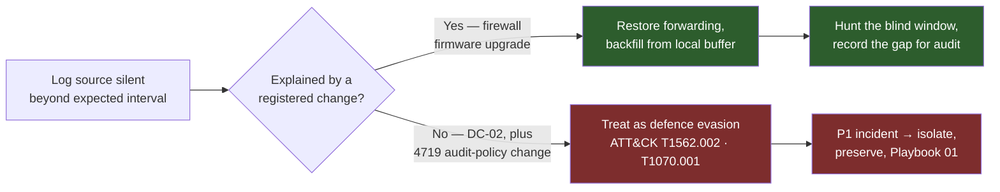
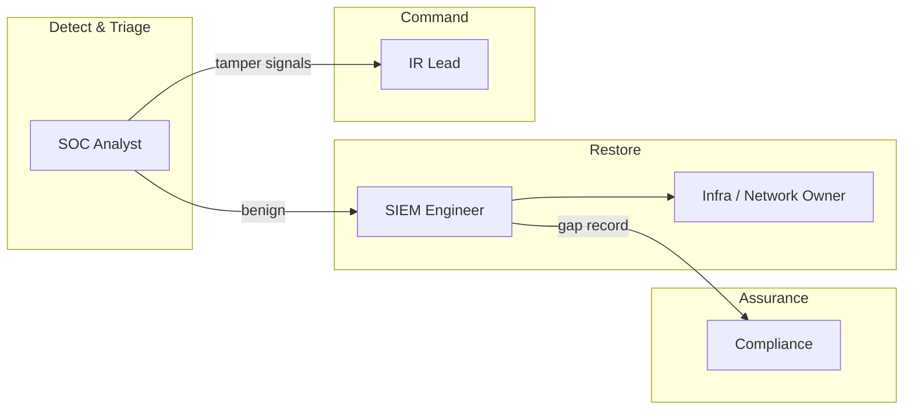
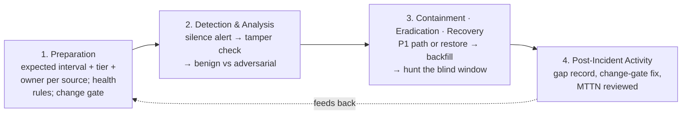
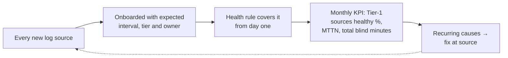

# Playbook 10 — Detection Engineering: When the Logs Go Quiet

> [!NOTE]
> The most dangerous alert is the one that can't fire because its data stopped arriving. Silence looks exactly like safety on a dashboard. This playbook treats **missing telemetry as a security event in its own right** — usually a broken pipeline, sometimes an adversary covering their tracks — and makes the difference provable.

**Contents:** Scenario Overview · Purpose and Scope · Risk Assessment · Policies and Procedures · Roles and Responsibilities · Incident Response Plan · Training · Continuous Improvement · Appendices

---

## 0. Scenario Overview

**Asset:** SIEM ingestion from two Tier-1 sources — the perimeter firewall cluster and a domain controller (DC-02).

**Trigger:** at 02:10 the log-source health rule fires twice.
- **Firewall:** no syslog for 3 h 40 m. A change ticket shows a firmware upgrade at 22:30 the previous night.
- **DC-02:** Security-log volume down 92% versus its hour-of-week baseline. No change ticket. The last events received before the drop include **4719** (audit policy changed) from an account that has never made that change before.

**Outcome:** the firewall gap is a benign pipeline failure — forwarding restored, logs backfilled, blind window hunted. DC-02 is defence evasion — escalated to P1 and handed to [Playbook 01](./01-credential-theft-ransomware.md).



> [!TIP]
> The question is never just *"how do we get the logs back?"* It's *"why did they stop, and what happened while we were blind?"* A benign cause still leaves a blind window that has to be hunted and documented.

---

## 1. Purpose and Scope
**Purpose:** detect loss of security telemetry quickly, decide within minutes whether it is benign or adversarial, restore coverage, and account for every blind window with evidence an auditor or regulator can follow.
**In scope:** SIEM data connectors, syslog and agent forwarders, EDR sensor health, cloud audit logs, parsing/normalisation failures, and ingestion delays.
**Out of scope:** tuning noisy rules ([Playbook 08](./08-siem-tuning-alert-fatigue.md)) and alerts that fired but were suppressed ([Playbook 06](./06-root-cause-analysis-silent-suppression.md)).

---

## 2. Risk Assessment

| Category | Finding |
|---|---|
| Critical assets | Tier-1 telemetry: identity (DCs, IdP), EDR, perimeter firewalls, cloud audit logs, VPN |
| Threat actors | Adversaries clearing logs or changing audit policy to hide activity; insiders with admin rights; plus non-adversarial causes — upgrades, expired certificates, full disks, parser changes |
| Vulnerabilities | No expected-interval definition per source; change processes that never verify log forwarding afterwards; health alerts routed to a mailbox nobody reads; no record of gaps for retention evidence |
| Impact | Undetected intrusion during the blind window; broken correlation; failed regulatory log-retention obligations (CERT-In requires 180 days of ICT logs maintained in India); audit findings on monitoring effectiveness |

**Risk score:** firewall gap — **MEDIUM** (benign, but 3 h 40 m of perimeter blindness). DC-02 — **CRITICAL** (active tampering on Tier-0 identity infrastructure).

---

## 3. Policies and Procedures

### 3.1 Detection and Governance Logic

```kql
// Sentinel — sources silent beyond their expected interval
let Expected = datatable(Source:string, Tier:int, MaxSilenceMin:int)
[ "CommonSecurityLog", 1, 30,      // firewalls
  "SecurityEvent",     1, 15,      // domain controllers / servers
  "SigninLogs",        1, 30,
  "Syslog",            2, 60 ];
union withsource=Source CommonSecurityLog, SecurityEvent, SigninLogs, Syslog
| where TimeGenerated > ago(1d)
| summarize LastSeen = max(TimeGenerated) by Source, Computer
| join kind=inner Expected on Source
| extend SilentMin = datetime_diff('minute', now(), LastSeen)
| where SilentMin > MaxSilenceMin
| order by Tier asc, SilentMin desc
```

```kql
// Tampering indicators that should escalate any silence immediately
SecurityEvent
| where TimeGenerated > ago(1d)
| where EventID in (1102, 1100, 4719)      // log cleared · event log service shutdown · audit policy changed
| project TimeGenerated, Computer, EventID, Account, Activity
```

```spl
# Splunk — silent index/sourcetype/host combinations
| tstats latest(_time) as last where index=* by index sourcetype host
| eval silent_min=round((now()-last)/60)
| where silent_min > 30
| sort - silent_min
```

```python
# Gate 1 — silence classification. Outcomes: EXPECTED / INVESTIGATE / INCIDENT
def classify_silence(tier: int, silent_min: int, max_silence: int,
                     in_change_window: bool, tamper_signals: bool) -> str:
    if tamper_signals:                         # 1102, 1100, 4719, EDR sensor tamper
        return "INCIDENT"                      # P1 — treat as defence evasion
    if silent_min <= max_silence:
        return "EXPECTED"
    if in_change_window and tier > 1:
        return "EXPECTED"                      # registered maintenance on non-critical source
    return "INVESTIGATE"                       # Tier-1 silence is never assumed benign

# Gate 2 — change closure. A change touching a log source cannot be closed
# until ingestion is verified. Outcomes: ALLOW / BLOCK
def can_close_change(change: dict) -> str:
    if change["touches_log_source"] and not change.get("ingestion_verified_at"):
        return "BLOCK"
    return "ALLOW"
```

### 3.2 Classification
| Field | Firewall gap | DC-02 |
|---|---|---|
| Category | Telemetry loss — pipeline failure after change | Telemetry loss — defence evasion |
| Severity | **P3** (P2 while the blind-window hunt is open) | **P1** |
| Confidence | High — change record + device logs show forwarding reset | High — 4719 from an unusual account + 92% volume drop, no change record |

### 3.3 Response
1. **Triage the silence (≤ 15 min):** is the source alive? Is the forwarder running? Is data arriving but failing to parse? Is it a delay rather than a loss? Check for tamper signals first — they change everything.
2. **Branch on cause:**
   - *Adversarial (DC-02):* declare P1, isolate per [Playbook 01](./01-credential-theft-ransomware.md), preserve the host's local logs and memory **before** restoring anything, and reset the account that changed audit policy.
   - *Benign (firewall):* restore forwarding, verify end-to-end with a test event.
3. **Backfill:** pull the gap from local buffers or device storage where available and ingest with original timestamps.
4. **Hunt the blind window:** run priority detections and hunting queries across the gap using backfilled data or adjacent sources (EDR, proxy, IdP).
5. **Record the gap:** source, start/end (UTC), cause, data recovered (%), hunt result. This is the evidence that answers *"were you monitoring on that night?"* for an auditor or regulator.
6. **Fix the process:** Gate 2 goes live — log-touching changes can't close without verified ingestion.

### 3.4 Communication
Health alerts route to the on-shift SOC queue, never a shared mailbox. The infrastructure owner is engaged for benign failures; the IR lead and CISO for any tampering. Compliance receives the gap record so retention reporting stays accurate. If tampering is confirmed as part of a reportable incident, the CERT-In 6-hour and SEBI clocks run from detection, per [Playbook 06](./06-root-cause-analysis-silent-suppression.md)'s clock board.

---

## 4. Roles and Responsibilities



| Role | RACI |
|---|---|
| SOC Analyst | **R** — triages silence, checks tamper signals, hunts the blind window |
| SIEM Engineer | **R** — restores pipeline, backfills, maintains expected-interval table |
| Infra / Network Owner | **R** — fixes device-side forwarding; verifies ingestion before closing changes |
| IR Lead | **A** — for adversarial silence (P1) |
| SOC Lead | **A** — for benign silence and the health programme |
| Compliance | **I** — receives gap records for retention and audit evidence |

---

## 5. Incident Response Plan



---

## 6. Train and Educate
- **Silence drill:** in a test window, deliberately stop a non-critical forwarder and measure **mean time to notice (MTTN)**. If nobody notices within the expected interval, the health rule — or its routing — is broken.
- **Infrastructure teams:** "verify logs after every change" added to the change template, with the one-line query to do it.
- **Tabletop:** "Your DC logs stopped at 02:00 and resumed at 06:00. Walk me through how you prove nothing happened."

---

## 7. Continuous Improvement


Expected intervals are reviewed quarterly from hour-of-week baselines, so bursty sources don't page at night and quiet sources aren't given hours of slack.

---

## Appendix A — Framework Mapping

| Framework | Item | ID / Ref |
|---|---|---|
| MITRE ATT&CK | Impair Defenses: Disable Windows Event Logging | T1562.002 |
| MITRE ATT&CK | Indicator Removal: Clear Windows Event Logs | T1070.001 |
| MITRE ATT&CK | Impair Defenses: Indicator Blocking | T1562.006 |
| MITRE ATT&CK | Impair Defenses: Disable or Modify Cloud Logs | T1562.008 |
| NIST CSF 2.0 | DE.CM — continuous monitoring | Health rules |
| ISO/IEC 27001:2022 | A.8.15 Logging · A.8.16 Monitoring · A.8.17 Clock synchronisation | Gap records, NTP |
| CERT-In Directions (2022) | 180-day ICT log retention in India; NTP synchronisation | Retention evidence |
| SEBI CSCRF | Detect function — continuous monitoring and SOC efficacy | Health KPIs |

## Appendix B — Severity / SLA Matrix
| Severity | Definition | SLA |
|---|---|---|
| P1 | Any silence with tamper signals (1102, 1100, 4719, EDR sensor tamper) | Immediate; IR lead engaged |
| P2 | Tier-1 source silent beyond expected interval, cause unknown | Triage 15 min; restore 2 h |
| P3 | Tier-1 silence explained by change, or Tier-2 silence | Restore same shift; hunt blind window within 24 h |
| P4 | Tier-3 silence or ingestion delay only | Next business day |

## Appendix C — Design Notes / FAQ

<details>
<summary>How do you set expected intervals for sources that are naturally bursty?</summary>

Use hour-of-week baselines rather than a single number: a DC at 03:00 on Sunday is quieter than at 10:00 on Monday. Alert on silence beyond, for example, the 99th percentile of the gap for that hour-of-week, with a hard ceiling for Tier-1 sources.
</details>

<details>
<summary>What's the difference between ingestion delay and data loss?</summary>

Delay means events arrive late with correct timestamps — detections may still fire, just late. Loss means events never arrive. Compare event time with ingestion time to tell them apart; persistent delay is still a problem, because time-windowed correlation rules can miss late data.
</details>

<details>
<summary>Why does compliance need the gap record if nothing bad happened?</summary>

Because "we were monitoring" is a claim auditors and regulators test. A documented gap with cause, duration, recovered data and a completed hunt is strong evidence. An undocumented gap discovered later looks like either negligence or concealment.
</details>

<details>
<summary>Why check for tamper signals before restoring the pipeline?</summary>

Restoring first can overwrite or rotate the very local logs that prove what happened. If there's any chance the silence is adversarial, preserve evidence before you fix anything.
</details>

---

**Related:** [Playbook 01 — Credential Theft → Ransomware](./01-credential-theft-ransomware.md) · [Playbook 08 — SIEM Tuning](./08-siem-tuning-alert-fatigue.md) · [Repository overview](../README.md)
