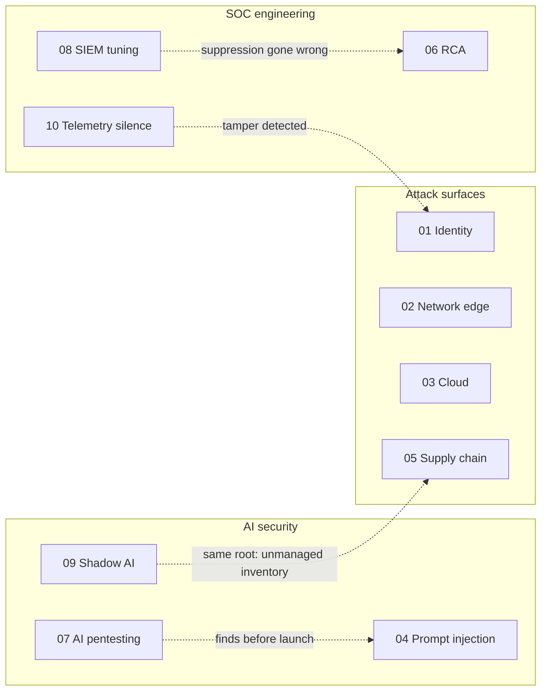

# 🛡️ Incident Response Playbooks


-black?style=flat-square)


Ten self-contained playbooks for the problems a modern SOC actually faces — from Kerberoasting and cloud exposure to **AI pentesting, shadow AI, alert fatigue and silent log sources**. Every playbook follows the same structure, so the layout becomes familiar fast and the differences that matter are in the content.

Each one opens with a concrete trigger scenario, maps to **MITRE ATT&CK** (or **ATLAS** / **OWASP LLM Top 10** for AI), and includes detection queries, a **policy-as-code** decision gate, a RACI, a severity/SLA matrix and design-notes FAQs explaining the non-obvious calls.

> 🤖 **AI assists. 🧠 Humans decide. 🔗 Everything is logged.**

---

## 📚 Playbooks

| # | Playbook | Domain | Primary reference |
|---|---|---|---|
| 01 | [Credential Theft → Ransomware](./playbooks/01-credential-theft-ransomware.md) | 🔑 Identity / AD / EDR | ATT&CK T1558.003 (Kerberoasting) |
| 02 | [WAF/DDoS Data-Integrity Attack](./playbooks/02-waf-ddos-data-integrity.md) | 🌐 Network edge / AppSec | ATT&CK T1498, T1190 |
| 03 | [CSPM Cloud Storage Exposure](./playbooks/03-cspm-cloud-exposure.md) | ☁️ Cloud posture | ATT&CK (Cloud) T1530 |
| 04 | [AI Governance: Prompt Injection](./playbooks/04-ai-governance-prompt-injection.md) | 🤖 AI / LLM systems | ATLAS AML.T0051 |
| 05 | [TPRM: Third-Party Data-Partner Compromise](./playbooks/05-tprm-supply-chain.md) | 🔗 Vendor / supply chain | ATT&CK T1199, T1195.002 |
| 06 | [RCA: The Alert That Fired and Was Silenced](./playbooks/06-root-cause-analysis-silent-suppression.md) | 🔎 Root cause analysis | ATT&CK T1539, T1550.004 · CERT-In · SEBI CSCRF |
| 07 | [AI Pentesting: Red-Teaming a RAG Copilot](./playbooks/07-ai-pentesting-llm-red-team.md) **🆕** | 🧪 AI security testing | ATLAS AML.T0051.001 · OWASP LLM01/02/05/07 |
| 08 | [SIEM Tuning: Alert Fatigue Without Losing Coverage](./playbooks/08-siem-tuning-alert-fatigue.md) **🆕** | 🔇 Detection engineering | ATT&CK T1110.003, T1562.001 |
| 09 | [AI Governance: Shadow AI & Data Leakage](./playbooks/09-ai-governance-shadow-ai-data-leakage.md) **🆕** | 🕶️ AI governance / DLP | ATT&CK T1567 · OWASP LLM02 |
| 10 | [When the Logs Go Quiet: Telemetry Silence](./playbooks/10-telemetry-silence-log-source-health.md) **🆕** | 📡 Log-source health | ATT&CK T1562.002, T1070.001 · CERT-In |

### 🗺️ Coverage map



| Playbook | Govern | Identify | Protect | Detect | Respond | Recover |
|---|:-:|:-:|:-:|:-:|:-:|:-:|
| 01 Credential theft → ransomware | | | ● | ● | ● | ● |
| 02 WAF/DDoS integrity | | | ● | ● | ● | ● |
| 03 CSPM exposure | | ● | ● | ● | ● | |
| 04 Prompt injection | ● | | ● | ● | ● | |
| 05 TPRM supply chain | ● | ● | | ● | ● | |
| 06 RCA | ● | | | ● | ● | ● |
| 07 AI pentesting | ● | ● | ● | | | |
| 08 SIEM tuning | ● | | | ● | | |
| 09 Shadow AI | ● | ● | ● | ● | ● | |
| 10 Telemetry silence | | | | ● | ● | ● |

<sub>Columns are NIST CSF 2.0 functions — the same six functions SEBI's CSCRF is built on.</sub>

---

## 🧭 Methodology

Every playbook follows the same anatomy:

| Section | What it answers |
|---|---|
| **0. Scenario Overview** | A concrete trigger and a two-branch diagram: what happens *without* the control vs *with* it |
| **1. Purpose and Scope** | What's covered — and, explicitly, what isn't |
| **2. Risk Assessment** | Assets, threat actors, vulnerabilities, impact, risk score |
| **3. Policies and Procedures** | Detection queries (KQL/SPL), a policy-as-code gate, classification, response, communication |
| **4. Roles and Responsibilities** | Escalation flow + RACI |
| **5. Incident Response Plan** | Mapped to NIST SP 800-61: Preparation → Detection & Analysis → Containment/Eradication/Recovery → Post-Incident |
| **6. Train and Educate** | A tabletop or drill specific to the scenario |
| **7. Continuous Improvement** | The feedback loop from real incidents back into detections and policy |
| **Appendices** | Framework mapping · severity/SLA matrix · design-notes FAQ |

A playbook that has never been run against a specific case reads like generic guidance. Starting from a concrete scenario is what makes each one executable under pressure.

---

## 🧩 Design Patterns Across the Set

- **⚖️ Policy-as-code gating.** High-impact decisions go through explicit, testable gates rather than full automation or pure judgement: `ALLOW / REQUIRE_APPROVAL / BLOCK` for AI tool calls (04), launch decisions (07), tuning changes (08) and GenAI usage (09); `EXPECTED / INVESTIGATE / INCIDENT` for telemetry silence (10). The dividing line stays consistent: automate what's low-risk and reversible, require a human for what's high-impact and hard to undo.
- **🕳️ The "unmanaged inventory" failure mode.** Shadow AI (04, 09), a forgotten partner integration (05) and a log source with no owner (10) are one problem in four domains — you can't govern or monitor what you don't know exists.
- **📏 Measure, don't assert.** AI findings are reported as attack success rate over N trials (07); tuning reports noise reduction *and* validated coverage together (08); blind windows are measured in minutes and hunted (10).
- **🧾 Evidence as a deliverable.** Gap records, RCA closure proof and regulatory clock boards (06, 10) exist so that "we were monitoring" and "we fixed it" are provable to an auditor or regulator — including CERT-In and SEBI CSCRF obligations.
- **🤝 Just culture.** Root causes are systems, not people (06, 08, 09). The developer who pasted code into a chatbot and the analyst who bulk-closed alerts both made reasonable choices under the conditions they had; the playbooks change the conditions.
- **🧪 Data integrity as a first-class question.** Playbooks 02 and 05 treat "was the data corrupted?" as seriously as "was there unauthorised access?"

The guardrail architecture used throughout — evidence boundaries, explainable risk scoring, human-in-the-loop approval, tamper-evident audit logging — is implemented as working code in [SOC-Incident-Orchestrator](https://github.com/CdxDebian/SOC-Incident-Orchestrator). The RCA method in Playbook 06 comes from [trace-rca-playbook](https://github.com/CdxDebian/trace-rca-playbook).

---

## 📁 Repository Structure

```
.
├── README.md
└── playbooks/
    ├── 01-credential-theft-ransomware.md
    ├── 02-waf-ddos-data-integrity.md
    ├── 03-cspm-cloud-exposure.md
    ├── 04-ai-governance-prompt-injection.md
    ├── 05-tprm-supply-chain.md
    ├── 06-root-cause-analysis-silent-suppression.md
    ├── 07-ai-pentesting-llm-red-team.md
    ├── 08-siem-tuning-alert-fatigue.md
    ├── 09-ai-governance-shadow-ai-data-leakage.md
    └── 10-telemetry-silence-log-source-health.md
```

---

## ⚠️ Notes on the Scenarios

Organisations and incidents are **illustrative composites**, not real reported breaches. Detection queries (KQL/SPL) and guardrail logic (Python) are written to be realistic and adaptable, not copy-paste production code — adjust field names, tables, thresholds and domain lists to your environment. Regulatory timelines (CERT-In, SEBI CSCRF, exchange circulars) are revised periodically; confirm against current publications before relying on them.

---

**Author:** Rahul Shrivastava — Security Operations Engineer · SOC · Incident Response · Security Automation
🌐 [Website](https://www.rahulshrivastava.co.in) · 💼 [LinkedIn](https://www.linkedin.com/in/shriv-rahul/) · 🐙 [GitHub](https://github.com/CdxDebian)
