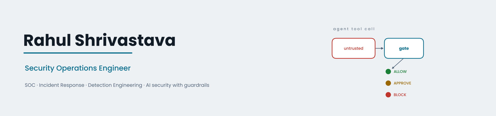
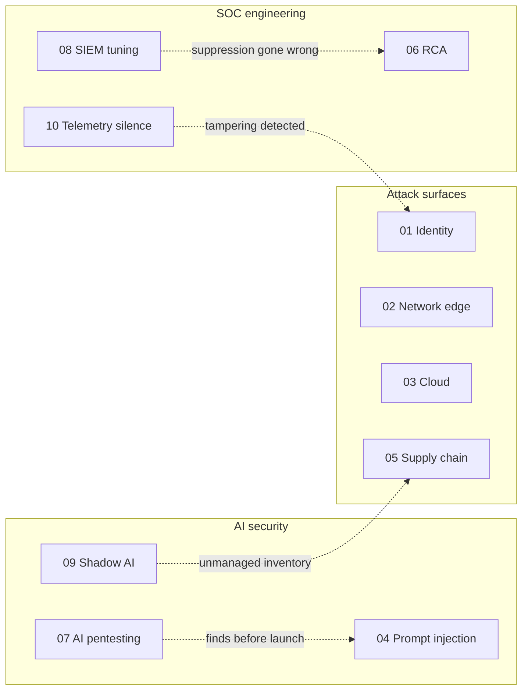

<p align="center">
  <picture>
    <source media="(prefers-color-scheme: dark)" srcset="assets/banner-dark.png" />
    
  </picture>
</p>

<div align="center">

# Incident Response Playbooks

**Scenario-driven response, detection and governance playbooks for a modern SOC — mapped to MITRE ATT&CK, MITRE ATLAS and the OWASP Top 10 for LLM Applications.**

[](#playbook-catalogue)
[](#mitre-attck-enterprise)
[](#mitre-atlas-adversarial-ai)
[](#owasp-top-10-for-llm-applications-2025)
[](#nist-csf-20-coverage)
[](#regulatory-alignment)
[](https://mitre-attack.github.io/attack-navigator/#layerURL=https%3A%2F%2Fraw.githubusercontent.com%2FCdxDebian%2FIR-Playbooks%2Fmain%2Fnavigator%2Fir-playbooks-attack-layer.json)

[Catalogue](#playbook-catalogue) · [ATT&CK](#mitre-attck-enterprise) · [ATLAS](#mitre-atlas-adversarial-ai) · [OWASP LLM](#owasp-top-10-for-llm-applications-2025) · [Methodology](#methodology) · [Design principles](#design-principles) · [Roadmap](#roadmap)

</div>

---

## Overview

Ten self-contained playbooks covering identity, network edge, cloud, supply chain, AI/LLM systems and SOC engineering. Each starts from a concrete trigger scenario rather than generic guidance, and each contains everything needed to run it under pressure:

| Every playbook includes | |
|---|---|
| Two-branch scenario diagram | What happens **without** the control vs **with** it |
| Threat-framework mapping | MITRE ATT&CK technique IDs, or MITRE ATLAS / OWASP LLM for AI threats |
| Detection logic | KQL and/or SPL queries, adaptable to Microsoft Sentinel, Defender XDR and Splunk |
| Policy-as-code gate | Testable decision logic (`ALLOW` / `REQUIRE_APPROVAL` / `BLOCK` and variants) in Python |
| Operating model | Escalation flow, RACI, severity/SLA matrix, NIST SP 800-61 lifecycle |
| Readiness | Scenario-specific tabletop, continuous-improvement loop, design-notes FAQ |

**By the numbers:** 10 playbooks · 27 ATT&CK techniques across 10 of 14 Enterprise tactics · 6 ATLAS techniques · 7 of 10 OWASP LLM risks tested · 44 Mermaid diagrams · 17 detection and policy-as-code blocks.

---

## Playbook Catalogue

| # | Playbook | Domain | ATT&CK / ATLAS | Gate pattern |
|:-:|---|---|---|---|
| 01 | [Credential Theft → Ransomware](./playbooks/01-credential-theft-ransomware.md) | Identity · AD · EDR | T1558.003, T1110.003, T1021.002, T1486 | `REQUIRE_APPROVAL` for account disable and host isolation |
| 02 | [WAF/DDoS Data-Integrity Attack](./playbooks/02-waf-ddos-data-integrity.md) | Network edge · AppSec | T1498, T1190, T1565.001 | Data-integrity guardrail alongside availability response |
| 03 | [CSPM Cloud Storage Exposure](./playbooks/03-cspm-cloud-exposure.md) | Cloud posture | T1530, T1078.004, T1526 | Auto-revert + OPA/Conftest pre-merge block |
| 04 | [AI Governance: Prompt Injection](./playbooks/04-ai-governance-prompt-injection.md) | AI / LLM systems | AML.T0051, AML.T0054, AML.T0024 | `ALLOW / REQUIRE_APPROVAL / BLOCK` on tool calls |
| 05 | [TPRM: Third-Party Data-Partner Compromise](./playbooks/05-tprm-supply-chain.md) | Vendor · supply chain | T1199, T1195.002, T1565.001 | Revoke key · quarantine feed · risk-tiered re-onboarding |
| 06 | [RCA: The Alert That Fired and Was Silenced](./playbooks/06-root-cause-analysis-silent-suppression.md) | Root cause analysis | T1539, T1550.004, T1213.003, T1567 | Suppression hygiene + RCA closure gates |
| 07 | [AI Pentesting: Red-Teaming a RAG Copilot](./playbooks/07-ai-pentesting-llm-red-team.md) | AI security testing | AML.T0051.001, AML.T0054, AML.T0056, AML.T0057 | Launch gate on open findings |
| 08 | [SIEM Tuning: Alert Fatigue Without Losing Coverage](./playbooks/08-siem-tuning-alert-fatigue.md) | Detection engineering | T1110.003, T1078, T1562.001 | Tuning-change gate in CI |
| 09 | [AI Governance: Shadow AI and Data Leakage](./playbooks/09-ai-governance-shadow-ai-data-leakage.md) | AI governance · DLP | T1567, T1552.001 · AML.T0057 | AI-usage gateway |
| 10 | [When the Logs Go Quiet: Telemetry Silence](./playbooks/10-telemetry-silence-log-source-health.md) | Log-source health | T1562.002, T1562.006, T1562.008, T1070.001 | Silence classification + change closure |



---

## Threat-Framework Coverage

### MITRE ATT&CK (Enterprise)

**Tactic coverage** — ordered along the ATT&CK matrix. Gaps are listed deliberately; they define the roadmap.

| Tactic | # | Techniques | Playbooks |
|---|:-:|---|---|
| Reconnaissance | — | *Not yet covered — see [Roadmap](#roadmap)* | — |
| Resource Development | — | *Not yet covered — see [Roadmap](#roadmap)* | — |
| Initial Access | 6 | [T1566.001](https://attack.mitre.org/techniques/T1566/001/), [T1190](https://attack.mitre.org/techniques/T1190/), [T1199](https://attack.mitre.org/techniques/T1199/), [T1195.002](https://attack.mitre.org/techniques/T1195/002/), [T1078](https://attack.mitre.org/techniques/T1078/), [T1078.004](https://attack.mitre.org/techniques/T1078/004/) | 01, 02, 03, 05, 08 |
| Execution | — | *Not yet covered — see [Roadmap](#roadmap)* | — |
| Persistence | 3 | [T1078](https://attack.mitre.org/techniques/T1078/), [T1078.004](https://attack.mitre.org/techniques/T1078/004/), [T1098.001](https://attack.mitre.org/techniques/T1098/001/) | 01, 03, 06, 08 |
| Privilege Escalation | 3 | [T1078](https://attack.mitre.org/techniques/T1078/), [T1078.004](https://attack.mitre.org/techniques/T1078/004/), [T1098.001](https://attack.mitre.org/techniques/T1098/001/) | 01, 03, 06, 08 |
| Defense Evasion | 8 | [T1078](https://attack.mitre.org/techniques/T1078/), [T1078.004](https://attack.mitre.org/techniques/T1078/004/), [T1562.001](https://attack.mitre.org/techniques/T1562/001/), [T1562.002](https://attack.mitre.org/techniques/T1562/002/), [T1562.006](https://attack.mitre.org/techniques/T1562/006/), [T1562.008](https://attack.mitre.org/techniques/T1562/008/), [T1070.001](https://attack.mitre.org/techniques/T1070/001/), [T1550.004](https://attack.mitre.org/techniques/T1550/004/) | 01, 03, 06, 08, 10 |
| Credential Access | 4 | [T1110.003](https://attack.mitre.org/techniques/T1110/003/), [T1558.003](https://attack.mitre.org/techniques/T1558/003/), [T1539](https://attack.mitre.org/techniques/T1539/), [T1552.001](https://attack.mitre.org/techniques/T1552/001/) | 01, 06, 08, 09 |
| Discovery | 3 | [T1087](https://attack.mitre.org/techniques/T1087/), [T1018](https://attack.mitre.org/techniques/T1018/), [T1526](https://attack.mitre.org/techniques/T1526/) | 01, 03 |
| Lateral Movement | 2 | [T1550.004](https://attack.mitre.org/techniques/T1550/004/), [T1021.002](https://attack.mitre.org/techniques/T1021/002/) | 01, 06 |
| Collection | 2 | [T1213.003](https://attack.mitre.org/techniques/T1213/003/), [T1530](https://attack.mitre.org/techniques/T1530/) | 03, 06 |
| Command and Control | — | *Not yet covered — see [Roadmap](#roadmap)* | — |
| Exfiltration | 1 | [T1567](https://attack.mitre.org/techniques/T1567/) | 06, 09 |
| Impact | 3 | [T1486](https://attack.mitre.org/techniques/T1486/), [T1498](https://attack.mitre.org/techniques/T1498/), [T1565.001](https://attack.mitre.org/techniques/T1565/001/) | 01, 02, 05 |

<details>
<summary><b>Full technique index (27 techniques)</b></summary>

| ID | Technique | Tactic(s) | Playbook(s) |
|---|---|---|---|
| [T1566.001](https://attack.mitre.org/techniques/T1566/001/) | Phishing: Spearphishing Attachment | Initial Access | [01](./playbooks/01-credential-theft-ransomware.md) |
| [T1190](https://attack.mitre.org/techniques/T1190/) | Exploit Public-Facing Application | Initial Access | [02](./playbooks/02-waf-ddos-data-integrity.md) |
| [T1199](https://attack.mitre.org/techniques/T1199/) | Trusted Relationship | Initial Access | [05](./playbooks/05-tprm-supply-chain.md) |
| [T1195.002](https://attack.mitre.org/techniques/T1195/002/) | Supply Chain Compromise: Compromise Software Supply Chain | Initial Access | [05](./playbooks/05-tprm-supply-chain.md) |
| [T1078](https://attack.mitre.org/techniques/T1078/) | Valid Accounts | Initial Access · Persistence · Privilege Escalation · Defense Evasion | [01](./playbooks/01-credential-theft-ransomware.md), [08](./playbooks/08-siem-tuning-alert-fatigue.md) |
| [T1078.004](https://attack.mitre.org/techniques/T1078/004/) | Valid Accounts: Cloud Accounts | Initial Access · Persistence · Privilege Escalation · Defense Evasion | [03](./playbooks/03-cspm-cloud-exposure.md) |
| [T1098.001](https://attack.mitre.org/techniques/T1098/001/) | Account Manipulation: Additional Cloud Credentials | Persistence · Privilege Escalation | [06](./playbooks/06-root-cause-analysis-silent-suppression.md) |
| [T1562.001](https://attack.mitre.org/techniques/T1562/001/) | Impair Defenses: Disable or Modify Tools | Defense Evasion | [08](./playbooks/08-siem-tuning-alert-fatigue.md) |
| [T1562.002](https://attack.mitre.org/techniques/T1562/002/) | Impair Defenses: Disable Windows Event Logging | Defense Evasion | [10](./playbooks/10-telemetry-silence-log-source-health.md) |
| [T1562.006](https://attack.mitre.org/techniques/T1562/006/) | Impair Defenses: Indicator Blocking | Defense Evasion | [10](./playbooks/10-telemetry-silence-log-source-health.md) |
| [T1562.008](https://attack.mitre.org/techniques/T1562/008/) | Impair Defenses: Disable or Modify Cloud Logs | Defense Evasion | [10](./playbooks/10-telemetry-silence-log-source-health.md) |
| [T1070.001](https://attack.mitre.org/techniques/T1070/001/) | Indicator Removal: Clear Windows Event Logs | Defense Evasion | [10](./playbooks/10-telemetry-silence-log-source-health.md) |
| [T1550.004](https://attack.mitre.org/techniques/T1550/004/) | Use Alternate Authentication Material: Web Session Cookie | Defense Evasion · Lateral Movement | [06](./playbooks/06-root-cause-analysis-silent-suppression.md) |
| [T1110.003](https://attack.mitre.org/techniques/T1110/003/) | Brute Force: Password Spraying | Credential Access | [01](./playbooks/01-credential-theft-ransomware.md), [08](./playbooks/08-siem-tuning-alert-fatigue.md) |
| [T1558.003](https://attack.mitre.org/techniques/T1558/003/) | Steal or Forge Kerberos Tickets: Kerberoasting | Credential Access | [01](./playbooks/01-credential-theft-ransomware.md) |
| [T1539](https://attack.mitre.org/techniques/T1539/) | Steal Web Session Cookie | Credential Access | [06](./playbooks/06-root-cause-analysis-silent-suppression.md) |
| [T1552.001](https://attack.mitre.org/techniques/T1552/001/) | Unsecured Credentials: Credentials In Files | Credential Access | [09](./playbooks/09-ai-governance-shadow-ai-data-leakage.md) |
| [T1087](https://attack.mitre.org/techniques/T1087/) | Account Discovery | Discovery | [01](./playbooks/01-credential-theft-ransomware.md) |
| [T1018](https://attack.mitre.org/techniques/T1018/) | Remote System Discovery | Discovery | [01](./playbooks/01-credential-theft-ransomware.md) |
| [T1526](https://attack.mitre.org/techniques/T1526/) | Cloud Service Discovery | Discovery | [03](./playbooks/03-cspm-cloud-exposure.md) |
| [T1021.002](https://attack.mitre.org/techniques/T1021/002/) | Remote Services: SMB/Windows Admin Shares | Lateral Movement | [01](./playbooks/01-credential-theft-ransomware.md) |
| [T1213.003](https://attack.mitre.org/techniques/T1213/003/) | Data from Information Repositories: Code Repositories | Collection | [06](./playbooks/06-root-cause-analysis-silent-suppression.md) |
| [T1530](https://attack.mitre.org/techniques/T1530/) | Data from Cloud Storage | Collection | [03](./playbooks/03-cspm-cloud-exposure.md) |
| [T1567](https://attack.mitre.org/techniques/T1567/) | Exfiltration Over Web Service | Exfiltration | [06](./playbooks/06-root-cause-analysis-silent-suppression.md), [09](./playbooks/09-ai-governance-shadow-ai-data-leakage.md) |
| [T1486](https://attack.mitre.org/techniques/T1486/) | Data Encrypted for Impact | Impact | [01](./playbooks/01-credential-theft-ransomware.md) |
| [T1498](https://attack.mitre.org/techniques/T1498/) | Network Denial of Service | Impact | [02](./playbooks/02-waf-ddos-data-integrity.md) |
| [T1565.001](https://attack.mitre.org/techniques/T1565/001/) | Data Manipulation: Stored Data Manipulation | Impact | [02](./playbooks/02-waf-ddos-data-integrity.md), [05](./playbooks/05-tprm-supply-chain.md) |

</details>

**ATT&CK Navigator layer:** [`navigator/ir-playbooks-attack-layer.json`](./navigator/ir-playbooks-attack-layer.json) — [open it directly in Navigator](https://mitre-attack.github.io/attack-navigator/#layerURL=https%3A%2F%2Fraw.githubusercontent.com%2FCdxDebian%2FIR-Playbooks%2Fmain%2Fnavigator%2Fir-playbooks-attack-layer.json). Score = number of playbooks covering a technique; each cell's comment names the playbooks.

### MITRE ATLAS (Adversarial AI)

[MITRE ATLAS](https://atlas.mitre.org) is the ATT&CK-style knowledge base for attacks on AI and machine-learning systems. Playbooks 04, 07 and 09 map to it.

| ID | Technique | Tactic | Playbook(s) | How it's handled |
|---|---|---|---|---|
| [AML.T0051](https://atlas.mitre.org/techniques/AML.T0051) | LLM Prompt Injection | Initial Access | [04](./playbooks/04-ai-governance-prompt-injection.md) | Evidence boundary + tool-call gate |
| [AML.T0051.001](https://atlas.mitre.org/techniques/AML.T0051.001) | LLM Prompt Injection: Indirect | Initial Access | [07](./playbooks/07-ai-pentesting-llm-red-team.md) | Poisoned RAG content found pre-launch; output channel closed |
| [AML.T0054](https://atlas.mitre.org/techniques/AML.T0054) | LLM Jailbreak | Privilege Escalation · Defense Evasion | [04](./playbooks/04-ai-governance-prompt-injection.md), [07](./playbooks/07-ai-pentesting-llm-red-team.md) | Measured as attack success rate over N trials |
| [AML.T0056](https://atlas.mitre.org/techniques/AML.T0056) | LLM Meta Prompt Extraction | Discovery | [07](./playbooks/07-ai-pentesting-llm-red-team.md) | Secrets removed from system prompts |
| [AML.T0057](https://atlas.mitre.org/techniques/AML.T0057) | LLM Data Leakage | Exfiltration | [07](./playbooks/07-ai-pentesting-llm-red-team.md), [09](./playbooks/09-ai-governance-shadow-ai-data-leakage.md) | URL/image sanitisation; AI-usage gateway + DLP |
| [AML.T0024](https://atlas.mitre.org/techniques/AML.T0024) | Exfiltration via AI Inference API | Exfiltration | [04](./playbooks/04-ai-governance-prompt-injection.md) | High-risk tools require human approval |

### OWASP Top 10 for LLM Applications (2025)

● primary scenario · ○ covered in the test matrix or controls · — not yet covered

| Risk | 04 | 07 | 09 |
|---|:-:|:-:|:-:|
| LLM01 Prompt Injection | ● | ● | — |
| LLM02 Sensitive Information Disclosure | ○ | ● | ● |
| LLM03 Supply Chain | — | — | — |
| LLM04 Data and Model Poisoning | — | ○ | — |
| LLM05 Improper Output Handling | — | ● | — |
| LLM06 Excessive Agency | ● | ○ | — |
| LLM07 System Prompt Leakage | — | ● | — |
| LLM08 Vector and Embedding Weaknesses | — | ○ | — |
| LLM09 Misinformation | — | — | — |
| LLM10 Unbounded Consumption | — | ○ | — |

### NIST CSF 2.0 Coverage

| Playbook | Govern | Identify | Protect | Detect | Respond | Recover |
|---|:-:|:-:|:-:|:-:|:-:|:-:|
| 01 Credential theft → ransomware | | | ● | ● | ● | ● |
| 02 WAF/DDoS integrity | | | ● | ● | ● | ● |
| 03 CSPM exposure | | ● | ● | ● | ● | |
| 04 Prompt injection | ● | | ● | ● | ● | |
| 05 TPRM supply chain | ● | ● | | ● | ● | |
| 06 RCA | ● | | | ● | ● | ● |
| 07 AI pentesting | ● | ● | ● | | | |
| 08 SIEM tuning | ● | | | ● | | |
| 09 Shadow AI | ● | ● | ● | ● | ● | |
| 10 Telemetry silence | | | | ● | ● | ● |

### Regulatory Alignment

| Framework | Where it appears |
|---|---|
| **CERT-In Directions (2022)** — 6-hour incident reporting, 180-day log retention in India, NTP synchronisation | 06 (regulatory clock board), 10 (gap records, retention evidence) |
| **SEBI CSCRF** — six-function structure, SOC efficacy, cyber audit evidence | 06, 08, 10 |
| **ISO/IEC 27001:2022** — A.5.23, A.8.12, A.8.15, A.8.16, A.8.17 | 08, 09, 10 |
| **NIST AI RMF 1.0 · ISO/IEC 42001:2023** | 07, 09 |

---

## Methodology

Every playbook follows the same anatomy, so the structure becomes familiar quickly and the differences that matter are in the content.

| Section | Purpose |
|---|---|
| **0. Scenario Overview** | Concrete trigger; two-branch diagram contrasting the uncontrolled and controlled outcomes |
| **1. Purpose and Scope** | What is covered — and, explicitly, what is not |
| **2. Risk Assessment** | Assets, threat actors, vulnerabilities, impact, risk score |
| **3. Policies and Procedures** | Detection queries, policy-as-code gate, classification, response steps, communication |
| **4. Roles and Responsibilities** | Escalation flow and RACI |
| **5. Incident Response Plan** | NIST SP 800-61: Preparation → Detection & Analysis → Containment, Eradication & Recovery → Post-Incident Activity |
| **6. Train and Educate** | Tabletop or drill designed for the scenario |
| **7. Continuous Improvement** | Feedback loop from incidents into detections, policy and metrics |
| **Appendices** | Framework mapping · severity/SLA matrix · design-notes FAQ |

---

## Design Principles

1. **Policy-as-code over judgement calls.** High-impact decisions run through explicit, testable gates — tool calls (04), launch readiness (07), tuning changes (08), GenAI usage (09), telemetry silence (10). Automate what is low-risk and reversible; require a human for what is high-impact or hard to undo.
2. **Unmanaged inventory is the common root cause.** Shadow AI (04, 09), a forgotten partner integration (05) and a log source without an owner (10) are one failure in four domains: what isn't inventoried can't be governed or monitored.
3. **Measure, don't assert.** AI findings are reported as attack success rate over N trials (07); tuning reports noise reduction *and* validated coverage together (08); blind windows are measured and hunted (10).
4. **Evidence is a deliverable.** RCA closure proof, regulatory clock boards and gap records (06, 10) make "we were monitoring" and "we fixed it" provable to auditors and regulators.
5. **Just culture.** Root causes are systems, not people (06, 08, 09). The playbooks change the conditions that made the unsafe choice the easy one.
6. **Integrity is as important as access.** Playbooks 02 and 05 treat "was the data altered?" as seriously as "was it accessed?"

The guardrail architecture used throughout — evidence boundaries, explainable risk scoring, human-in-the-loop approval, tamper-evident audit logging — is implemented as working code in [SOC-Incident-Orchestrator](https://github.com/CdxDebian/SOC-Incident-Orchestrator). Playbook 06's RCA method comes from [trace-rca-playbook](https://github.com/CdxDebian/trace-rca-playbook).

---

## Using These Playbooks

- **Tabletop exercises:** each Section 6 is a ready-made exercise. Run the scenario, then compare the team's decisions with Section 3.
- **Detection engineering:** queries are starting points. Adjust tables, field names, thresholds and watchlists to your environment, and validate with a simulation before production.
- **Gap analysis:** load the Navigator layer alongside your own detection-coverage layer to see where playbooks exist without detections, and vice versa.
- **Review cadence:** each playbook carries `last_updated` in its frontmatter. Review quarterly, after any material incident, and whenever ATT&CK, ATLAS or a regulation changes.

---

## Repository Structure

```
.
├── README.md
├── navigator/
│   └── ir-playbooks-attack-layer.json
└── playbooks/
    ├── 01-credential-theft-ransomware.md
    ├── 02-waf-ddos-data-integrity.md
    ├── 03-cspm-cloud-exposure.md
    ├── 04-ai-governance-prompt-injection.md
    ├── 05-tprm-supply-chain.md
    ├── 06-root-cause-analysis-silent-suppression.md
    ├── 07-ai-pentesting-llm-red-team.md
    ├── 08-siem-tuning-alert-fatigue.md
    ├── 09-ai-governance-shadow-ai-data-leakage.md
    └── 10-telemetry-silence-log-source-health.md
```

---

## Roadmap

Planned playbooks, chosen to close the ATT&CK and OWASP LLM gaps above:

| Planned playbook | Closes |
|---|---|
| Command-and-control beaconing from a trading or research host | ATT&CK **Command and Control** |
| Living-off-the-land execution (encoded PowerShell, LOLBins) | ATT&CK **Execution** |
| External attack-surface and brand-impersonation monitoring | ATT&CK **Reconnaissance** · **Resource Development** |
| Agentic AI: excessive agency in an autonomous SOC agent | OWASP **LLM06** (primary) · ATLAS |
| AI supply chain: compromised model or embedding dependency | OWASP **LLM03** · **LLM04** |

---

## Disclaimer

Organisations and incidents are **illustrative composites**, not real reported breaches. Detection queries and guardrail logic are realistic and adaptable, not drop-in production code. ATT&CK and ATLAS identifiers reflect the versions current at writing; regulatory timelines (CERT-In, SEBI CSCRF, exchange circulars) are revised periodically — confirm against current publications before relying on them.

---

<div align="center">

**Rahul Shrivastava** — Security Operations Engineer · SOC · Incident Response · Security Automation

[Website](https://www.rahulshrivastava.co.in) · [LinkedIn](https://www.linkedin.com/in/shriv-rahul/) · [GitHub](https://github.com/CdxDebian)

</div>
