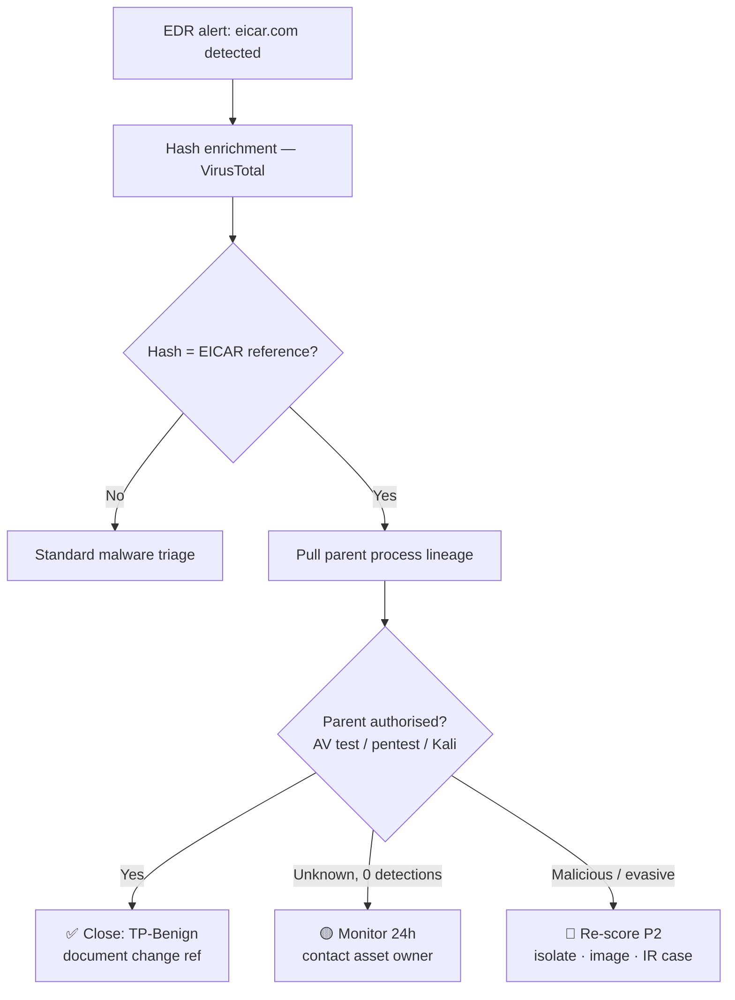

# 🛡️ SOC Case Study — When the "Malware" Is a Test File, but the Parent Might Not Be

> **File reputation & threat-intel triage of SHA-256 `275a021b…651fd0f` (EICAR) — L2 → L3 escalation write-up**

-blue)
-lightgrey)

| | |
|---|---|
| **Analyst** | Rahul Shrivastava — SOC Analyst (L2) · [rahulshrivastava.co.in](https://www.rahulshrivastava.co.in) |
| **Date** | 02 October 2026 |
| **Data source** | [VirusTotal](https://www.virustotal.com/gui/file/275a021bbfb6489e54d471899f7db9d1663fc695ec2fe2a2c4538aabf651fd0f/relations) — snapshot 02 Oct 2026, 18:24 UTC |
| **Tools** | VirusTotal · EDR process lineage · MITRE ATT&CK |

> [!NOTE]
> This is a sanitised portfolio version of an internal escalation report. Host names, users and ticket IDs have been removed. All indicators are public and defanged where relevant.

---

## 📌 TL;DR

| Question | Answer |
|---|---|
| What is it? | The **EICAR Standard Anti-Virus Test File** — a 68-byte ASCII string used to verify AV/EDR works. |
| Is it dangerous? | **No.** No payload, no persistence, no C2. |
| Then why escalate? | VirusTotal links it to **3.7K execution parents**, some scored **49–64/72**. EICAR is harmless; the process that dropped it may not be. |
| Decision driver | **Parent-process lineage** on the endpoint. |

---

## 🔍 Triage Flow

> [!TIP]
> The same hash appears whether a sysadmin is testing antivirus or a loader is probing your defences before dropping its real payload. **Always pivot to the parent.**

---

## 1. File Identification

| Field | Value |
|---|---|
| File name | `eicar.com` (also `eicar.txt`, `test.txt.txt`, `eicar.com-<n>`) |
| Size | 68 bytes |
| Type | EICAR antivirus test file (TrID 100%) — VT's "Powershell" type label is a text-content misclassification |
| SHA-256 | `275a021bbfb6489e54d471899f7db9d1663fc695ec2fe2a2c4538aabf651fd0f` |
| SHA-1 | `3395856ce81f2b7382dee72602f798b642f14140` |
| MD5 | `44d88612fea8a8f36de82e1278abb02f` |
| SSDEEP | `3:a+JraNvsgzsVqSwHq9:tJuOgzsko` |
| TLSH | `T141A022003B0EEE2BA20B00200032E8B00808020E2CE00A3820A020B8C83308803EC228` |
| First seen | 22 May 2006 |
| Submissions | 1,167,030 from 3,557 unique sources |

## 2. Reputation Scorecard

| Signal | Value | Read |
|---|---|---|
| AV detections | **66 / 68** | Expected — EICAR is built to be caught |
| Undetected | 2 (CrowdStrike, Acronis) | ML engines often skip inert strings |
| Type-unsupported | 7 | BitDefenderFalx, tehtris, DeepInstinct, Trapmine, Paloalto, Cylance, Trustlook |
| Community score | **+3,797** | Trusted |
| Votes | 2,309 harmless / 422 malicious | 84.5% harmless |
| Known distributor | OffSec Services Ltd | Ships in Kali Linux, Kali Purple, NetHunter, BlackArch |
| NSRL | Listed | NIST known-software set |

<b>Representative vendor verdicts</b> — note how vendors say "not a virus"

| Engine | Detection |
|---|---|
| Kaspersky / Ikarus | EICAR-Test-File |
| BitDefender / Arcabit / VIPRE | EICAR-Test-File (not a virus) |
| Avast | EICAR Test-NOT virus!!! |
| ESET-NOD32 | Eicar test file |
| Sophos / Malwarebytes | EICAR-AV-Test |
| Symantec | EICAR Test String |
| Dr.Web | EICAR Test File (NOT a Virus!) |
| SUPERAntiSpyware | NotAThreat.EICAR[TestFile] |
| Tencent | EICAR.TEST.NOT-A-VIRUS |
| ClamAV | Eicar-Test-Signature |

## 3. Threat Intel Enrichment

| Source | Result |
|---|---|
| YARA | `malw_eicar` (ATR) · `Multi_EICAR_ac8f42d6` (Elastic) · `SUSP_Just_EICAR` (Neo23x0) |
| Sigma | 1 × Low |
| IDS | 1 × Low |
| Sandboxes | Zenbox ⚠️ · Lastline ⚠️ · OS X Sandbox ⚠️ (signature-driven) · Yomi Hunter ✅ Clean |

> [!WARNING]
> VT tags this hash `via-tor`, `long-sleeps`, `detect-debug-environment`. A 68-byte ASCII string can do none of these. These tags are **inherited from parent samples and sandbox context** — never attribute them to EICAR in a case record. They do, however, tell you some parents are evasive.

## 4. Relations Analysis

| Relationship | Count | Interpretation |
|---|---|---|
| Contacted domains | 30 | Sandbox OS/CDN noise (Akamai, Apple, MSN, Snapcraft, Adobe, Fastly); 1 domain at 1/91 |
| Contacted IPs | 110 | Mostly AS16509 (Amazon) / AS20940 (Akamai) — environmental |
| **Execution parents** | **3.7K** | **Primary pivot** — mix of test tools and real droppers |
| PE resource parents | 100 | Binaries embedding EICAR in resources |
| Dropped files | 84 | macOS Mach-O sandbox artefacts (0/64) |
| Graphs | 80 | Community investigations |

**Notable execution parents (sampled)**

| Parent | Type | Detections | Read |
|---|---|---|---|
| `bioj233a.exe` | Win32 EXE | 64/72 | 🔴 Malicious |
| `augustus4.18-deobfuscated.zip` | ZIP | 55/65 | 🔴 Malicious |
| `z63h.za.com.exe` | Win32 EXE | 55/70 | 🔴 Malicious |
| `XmqSACvRCBh.exe` | Win32 EXE | 49/72 | 🔴 Loader-style naming |
| `testeav.exe` | Win32 EXE | 46/71 | 🟡 AV-test utility |
| `pdf-doc-vba-eicar-dropper.pdf` | PDF | 37/64 | 🟡 Test dropper |
| `make_eicar.py` | Python | 6/61 | 🟢 Generator script |
| `linux.sh` | Shell | 0/62 | 🟢 Benign |

## 5. Key Findings

1. **Identity confirmed** — all hashes match the public EICAR reference; TrID 100%.
2. **No intrinsic threat** — no execution, network, persistence or credential behaviour.
3. **Controls validated** — the EDR detection is a health signal, not a breach signal.
4. **Behaviour tags are inherited noise** — attribute them to parents, not the file.
5. **Risk lives upstream** — an unexplained EICAR write may be a loader or an attacker probing AV coverage.

## 6. MITRE ATT&CK (only if parent is unauthorised)

| ID | Technique | Why |
|---|---|---|
| T1518.001 | Security Software Discovery | Dropping EICAR to see if AV reacts |
| T1497 | Virtualization/Sandbox Evasion | Parent-level anti-debug / long-sleep |
| T1090.003 | Multi-hop Proxy | Parent-level `via-tor` |
| T1105 | Ingress Tool Transfer | EICAR delivered alongside other files |

## 7. Recommendations

**Investigate**
- [ ] Pull EDR process tree: parent, grandparent, command line, user, signer
- [ ] Match against change records (AV test, pentest window, Kali usage)
- [ ] Enrich parent hash; check for sibling files written in the same second
- [ ] Review ±30 min for Tor egress and new persistence

**Engineer**
- ❌ Do **not** globally allow-list the EICAR hash — it blinds AV-health checks and hides attacker probing
- ✅ Scope suppressions to approved test hosts/accounts with an expiry
- ✅ Auto-enrich EICAR alerts with parent-process reputation to cut triage time

## 8. Indicators

See [`iocs.csv`](./iocs.csv). Full L3 escalation report: [`L3-escalation-report.pdf`](./L3-escalation-report.pdf). Blocking is **not** recommended for the EICAR hash itself — block decisions apply to a confirmed-malicious parent.

---

<b>FAQ</b>

**Why does VirusTotal show 66 detections if it's harmless?**
Because every engine is *required* to detect it — that's the point of a test file.

**Should a SOC just auto-close EICAR alerts?**
Only on approved test assets. Elsewhere, an EICAR alert is a cheap tripwire for unexpected process activity.

**Why does VT call it "Powershell"?**
Type heuristics on short text content; TrID and magic bytes confirm EICAR.

---

**Rahul Shrivastava** · SOC Analyst & Penetration Tester
🌐 [rahulshrivastava.co.in](https://www.rahulshrivastava.co.in) · 💼 [LinkedIn](https://www.linkedin.com/in/shriv-rahul/) · 🐙 [GitHub](https://github.com/CdxDebian)

*References: [VirusTotal report](https://www.virustotal.com/gui/file/275a021bbfb6489e54d471899f7db9d1663fc695ec2fe2a2c4538aabf651fd0f) · [EICAR](https://www.eicar.org/) · [MITRE ATT&CK](https://attack.mitre.org/)*
